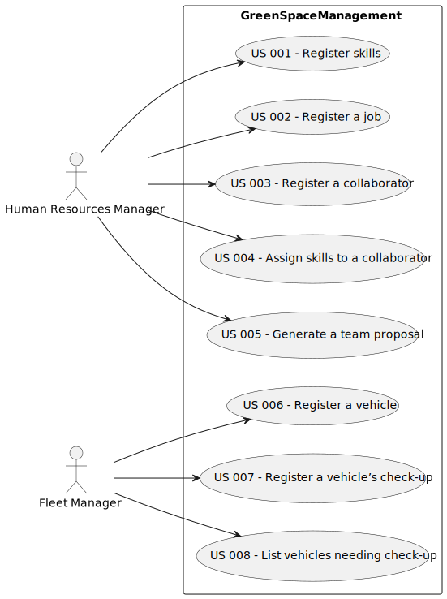

# Use Case Diagram (UCD)

**In the scope of this project, there is a direct relationship of _1 to 1_ between Use Cases (UC) and User Stories (US).**

However, be aware, this is a pedagogical simplification. On further projects and course units there may also exist _1 to N **and/or** N to 1_ relationships between UC and US.

**Insert below the Use Case Diagram in a SVG format**

**For each UC/US, it must be provided evidences of applying main activities of the software development process (requirements, analysis, design, tests and code). Gather those evidences on a separate file for each UC/US and set up a link as suggested below.**

# Use Cases / User Stories

| UC/US | Description                                     |                   
|:------|:------------------------------------------------|
| US001 | [register skills that a collaborator may have](../../us001/Readme.md)   |
| ...   | ...                                             |
| US002 | [Short name for US002](../../us001/Readme.md)   |
| ...   | ...                                             |
| US003 | [Short name for US003](../../us001/Readme.md)   |
| ...   | ...                                             |
| US004 | [Short name for US004](../../us001/Readme.md)   |
| ...   | ...                                             |
| US005 | [Short name for US005](../../us001/Readme.md)   |
| ...   | ...                                             |
| US006 | [Create a Task](../../us006_template/Readme.md) |
| ...   | ...                                             |
| US007 | [Register a vehicle’s check-up](../../us007/Readme.md)   |
| ...   | ...                                             |
| US008 | [Short name for US008](../../us008/Readme.md)   |
