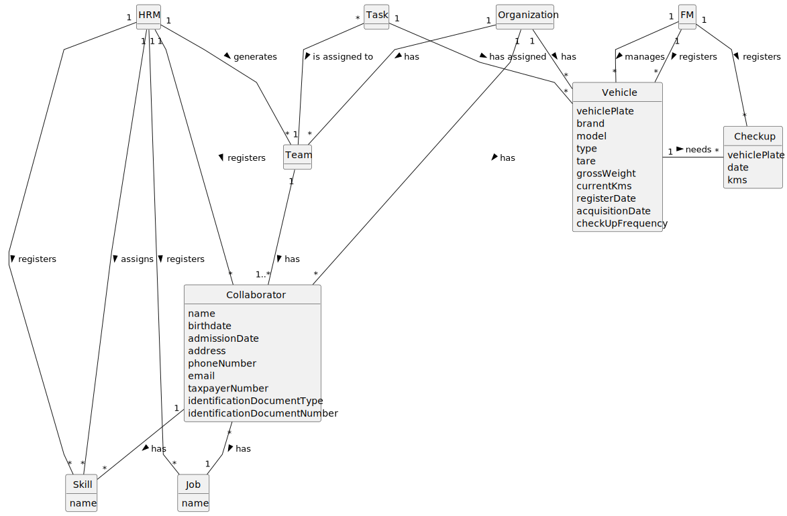

# OO Analysis

The construction process of the domain model is based on the client specifications, especially the nouns (for _concepts_) and verbs (for _relations_) used.

## Rationale to identify domain conceptual classes
To identify domain conceptual classes, start by making a list of candidate conceptual classes inspired by the list of categories suggested in the book "Applying UML and Patterns: An Introduction to Object-Oriented Analysis and Design and Iterative Development".

### _Conceptual Class Category List_

**Business Transactions**

* Task

---

**Transaction Line Items**

* 

---

**Product/Service related to a Transaction or Transaction Line Item**

* Portal

---

**Transaction Records**

* Agenda

---  

**Roles of People or Organizations**

* Human Resources Manager
* Vehicle and Equipment Fleet Manager
* Collaborator
* Green Spaces Manager
* Green Spaces User
* Employee

---

**Places**

* Green Space

---

**Noteworthy Events**

* Check-up

---

**Physical Objects**

* Vehicle
* Machine
* Equipment

---

**Descriptions of Things**

* Job
* Skill

---

**Catalogs**

* 

---

**Containers**

* Team

---

**Elements of Containers**

* 

---

**Organizations**

* MusgoSublime

---

**Other External/Collaborating Systems**

* 

---

**Records of finance, work, contracts, legal matters**

* 

---

**Financial Instruments**

* 

---

**Documents mentioned/used to perform some work/**

* 

---

## Rationale to identify associations between conceptual classes

An association is a relationship between instances of objects that indicates a relevant connection and that is worth of remembering, or it is derivable from the List of Common Associations:

- **_A_** is physically or logically part of **_B_**
- **_A_** is physically or logically contained in/on **_B_**
- **_A_** is a description for **_B_**
- **_A_** known/logged/recorded/reported/captured in **_B_**
- **_A_** uses or manages or owns **_B_**
- **_A_** is related with a transaction (item) of **_B_**
- etc.

| Concept (A) 		                      |      Association   	      |                 Concept (B) |
|-------------------------------------|:-------------------------:|----------------------------:|
| Task  	                             | is carried out by    		 	 |                Collaborator |
| Task  	                             | is carried out in    		 	 |                 Green Space |
| Task                                |       is defined in       |                      Agenda |
| Task                                |     is carried out by     |                        Team |
| Collaborator                        |           has a           |                         Job |
| Collaborator                        |           is an           |                    Employee |
| Skill                               |      is assigned to       |                Collaborator |
| Team                                |            has            |                Collaborator |
| Human Resources Manager             |          defines          |                        Team |
| Human Resources Manager             |         registers         |                       Skill |
| Human Resources Manager             |         registers         |                         Job |
| Human Resources Manager             |         registers         |                Collaborator |
| Human Resources Manager             |          assigns          |                       Skill |
| Vehicle and Equipment Fleet Manager |          manages          | Machine, Equipment, Vehicle |
| Vehicle and Equipment Fleet Manager |         registers         |                     Vehicle |
| Vehicle and Equipment Fleet Manager |         registers         |                    Check-up |
| Machine, Equipment, Vehicle         |      is assigned to       |                        Task |
| Green Spaces Manager                |          manages          |                 Green Space |
| Green Spaces User                   |           uses            |                 Green Space |
| Green Spaces User                   |           uses            |                      Portal |
| Vehicle                             |           needs           |                    Check-up |
| Organization                        |            has            |                Collaborator |
| Organization                        |            has            |                     Vehicle |
| Organization                        |            has            |                        Team |

## Domain Model

**Do NOT forget to identify concept atributes too.**

**Insert below the Domain Model Diagram in a SVG format**

