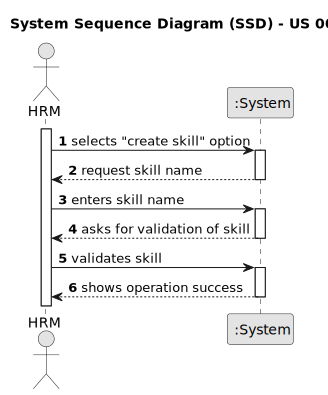

# US 001 - Display Listed Properties

## 1. Requirements Engineering

### 1.1. User Story Description

### 1.2. Customer Specifications and Clarifications 

**From the specifications document:**

**From the client clarifications:**

### 1.3. Acceptance Criteria

### 1.4. Found out Dependencies

* There is no dependency to US001.

### 1.5 Input and Output Data

**Input Data:**

* Typed data:

	
* Selected data:

**Output Data:**

### 1.6. System Sequence Diagram (SSD)

### 1.7 Other Relevant Remarks

