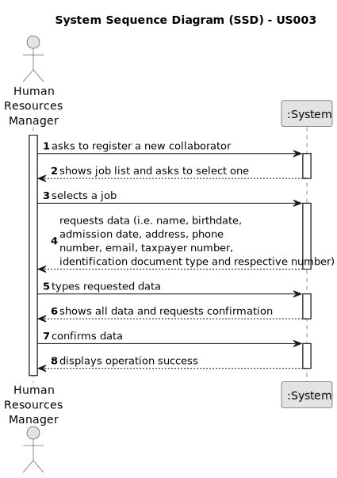

# US003 - Register a collaborator

## 1. Requirements Engineering

### 1.1. User Story Description

As an HRM, I want to register a collaborator with a job and fundamental characteristics.

### 1.2. Customer Specifications and Clarifications 

**From the specifications document:**

>	Each collaborator has a main job (exclusively one).

>   Each collaborator is characterized by a set of characteristics.

**From the client clarifications:**

> **Question:** What are the fundamental characteristics of a collaborator?
>
> **Answer:** The minimal required data to characterize a collaborator is their name, birthdate, admission date, address, contact (email or phone number), identification document and number. Other relevant data can also be considered.

> **Question:** When creating a collaborator with an existing name ... What does the system do?
> 
> **Answer:** It's not common and most improbable to have different individual with same name in the same context, however it’s ID documentation number should be unique for sure.

### 1.3. Acceptance Criteria

* **AC1:** All required fields must be filled in.
* **AC2:** When registering a collaborator with an existing ID documentation number, the system must reject such operation.

### 1.4. Found out Dependencies

* There is a dependency on "US002 - Register a job" as there must be at least one job to be attributed to the collaborator being registered.

### 1.5 Input and Output Data

**Input Data:**

* Typed data:
    * a name
    * a birthdate
    * an admission date
    * an address
    * a contact
    * an identification document
    * a number
	
* Selected data:
    * a job

**Output Data:**

* List of existing jobs
* (In)Success of the operation

### 1.6. System Sequence Diagram (SSD)

### 1.7 Other Relevant Remarks