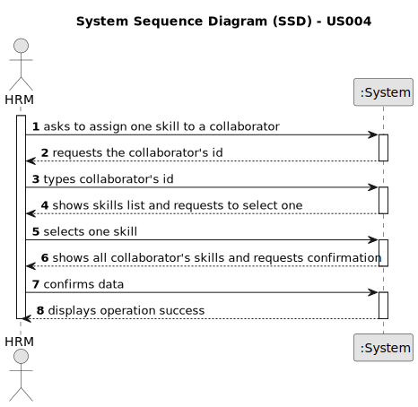

# US004 - Assign skill to a collaborator

## 1. Requirements Engineering

### 1.1. User Story Description

As an HRM, I want to assign one or more skills to a collaborator.

### 1.2. Customer Specifications and Clarifications 

**From the specifications document:**

>	An employee has a set of skills that enable him to perform/take on certain tasks/responsibilities

**From the client clarifications:**

> **Question:** In US04, it's related to associating skills with an employee. My question is:
> 1. is there a minimum and maximum number of skills?
> 2. is there any special characteristic required for the employee to have in order to have these skills added?
>
> **Answer:** 1. No; 2. No.

> **Question:** Regarding registering a skill, we have a couple of questions:
> - Can any skill be registered to any collaborator/job? Or should they be associated in categories in association with a specific job
> - Should it be possible to add the same skill to a collaborator multiple times?
> - Is there any certification/proof needed to register a skill to a colaborator?
>
> **Answer:**
> - There is no association, it totally depends of the CV of the collaborator.
> - That does not make sense
> - no.

> **Question:** Can a collaborator have no skills assigned?
>
> **Answer:**
> - yes.

### 1.3. Acceptance Criteria

* There's no acceptance criteria defined for this user story.

### 1.4. Found out Dependencies

* There is a dependency on "US003 - Register a collaborator" as there must be at least one collaborator to assign a skill to.

### 1.5 Input and Output Data

**Input Data:**

* Typed data:
    * collaborator's id

* Selected data:
  * a skill

**Output Data:**

* List of collaborator's skills
* (In)Success of the operation

### 1.6. System Sequence Diagram (SSD)

### 1.7 Other Relevant Remarks

* There are no other relevant remarks for this user story.