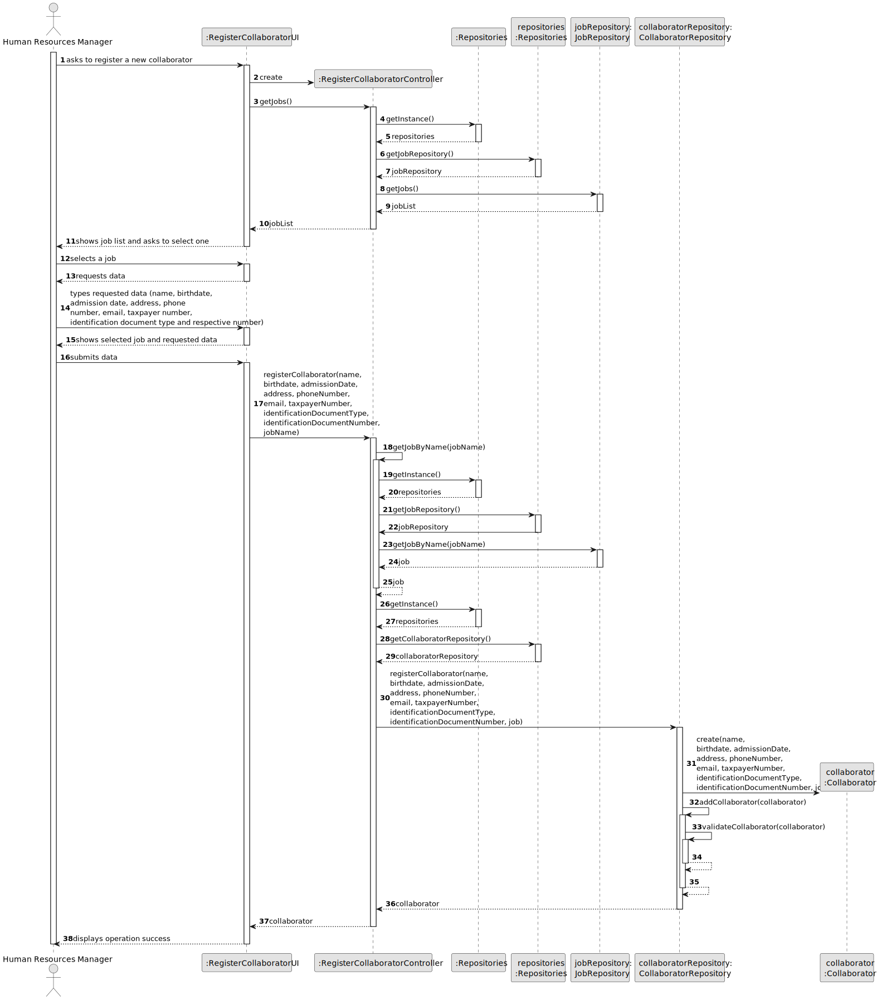
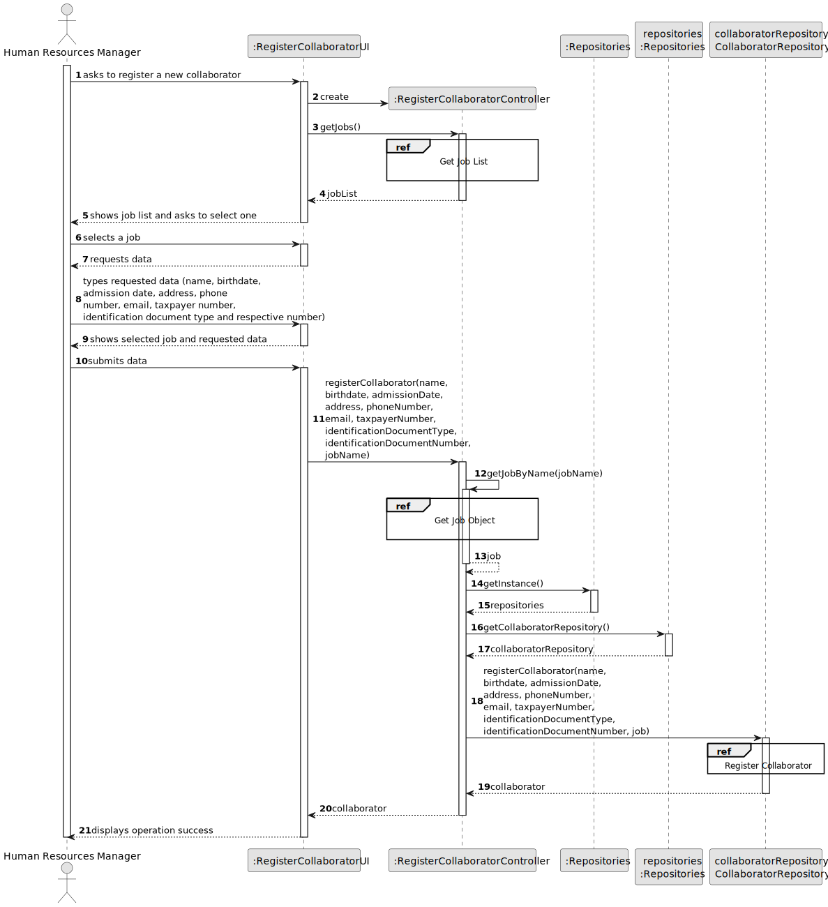
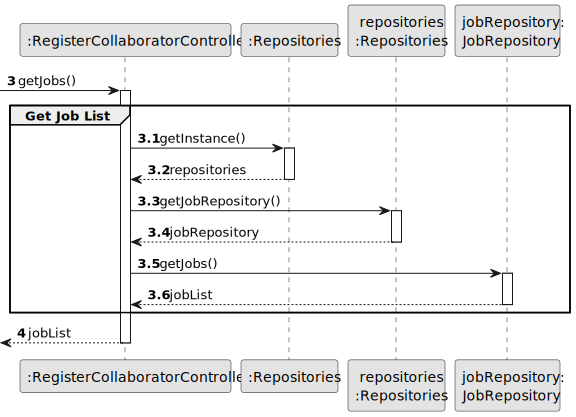
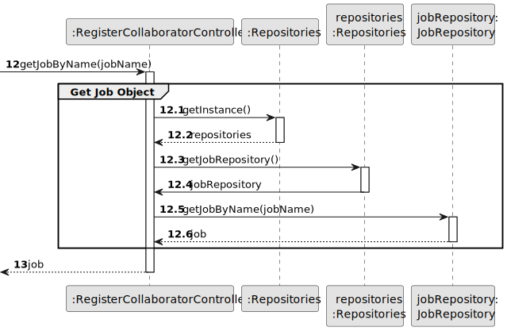
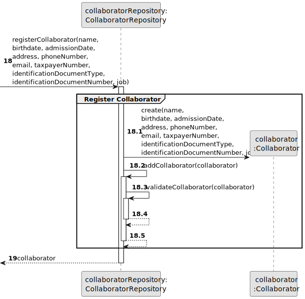

# US003 - Register a collaborator

## 3. Design - User Story Realization 

### 3.1. Rationale

| Interaction ID | Question: Which class is responsible for...                  | Answer                         | Justification (with patterns)        |
|:---------------|:-------------------------------------------------------------|:-------------------------------|:-------------------------------------|
| Step 1  		     | 	... interacting with the actor?                             | RegisterCollaboratorUI         | Pure Fabrication                     |
|                | ... coordinating the US?                                     | RegisterCollaboratorController | Pure Fabrication, Controller         |
| 			  		        | 	... obtaining the jobs list?                                | JobRepository                  | Pure Fabrication, Information Expert |
| Step 2  		     | ... displaying the jobs?						                               | RegisterCollaboratorUI         | Pure Fabrication                     |
| Step 3  		     | 	... temporarily keeping the selected job?                   | RegisterCollaboratorUI         | Pure Fabrication                     |
| Step 4  		     | 	... displaying the form for the actor to input data?        | RegisterCollaboratorUI         | Pure Fabrication                     |
| Step 5  		     | 	... temporarily keeping the input data?                     | RegisterCollaboratorUI         | Pure Fabrication                     |
| Step 6  		     | 	... displaying all the information before submitting?						 | RegisterCollaboratorUI         | Pure Fabrication                     | 
| Step 7			  		  | 	... saving the created collaborator?                        | CollaboratorRepository         | Pure Fabrication, Creator (R: 1, 2)  | 
| 		             | 	... validating all data (local validation)?                 | Collaborator                   | Information Expert                   | 
| 			  		        | 	... validating all data (global validation)?                | CollaboratorRepository         | Pure Fabrication, Information Expert |
| Step 8  		     | 	... informing operation success?                            | RegisterCollaboratorUI         | Pure Fabrication                     |

### Systematization ##

According to the taken rationale, the conceptual classes promoted to software classes are: 

* Collaborator

Other software classes (i.e. Pure Fabrication) identified: 

* RegisterCollaboratorUI  
* RegisterCollaboratorController
* CollaboratorRepository
* JobRepository

## 3.2. Sequence Diagram (SD)

### Full Diagram

This diagram shows the full sequence of interactions between the classes involved in the realization of this user story.

### Split Diagrams

The following diagram shows the same sequence of interactions between the classes involved in the realization of this user story, but it is split in partial diagrams to better illustrate the interactions between the classes.

It uses Interaction Occurrence (a.k.a. Interaction Use).

**Get Job List**

**Get Job Object**

**Register Collaborator**

## 3.3. Class Diagram (CD)

