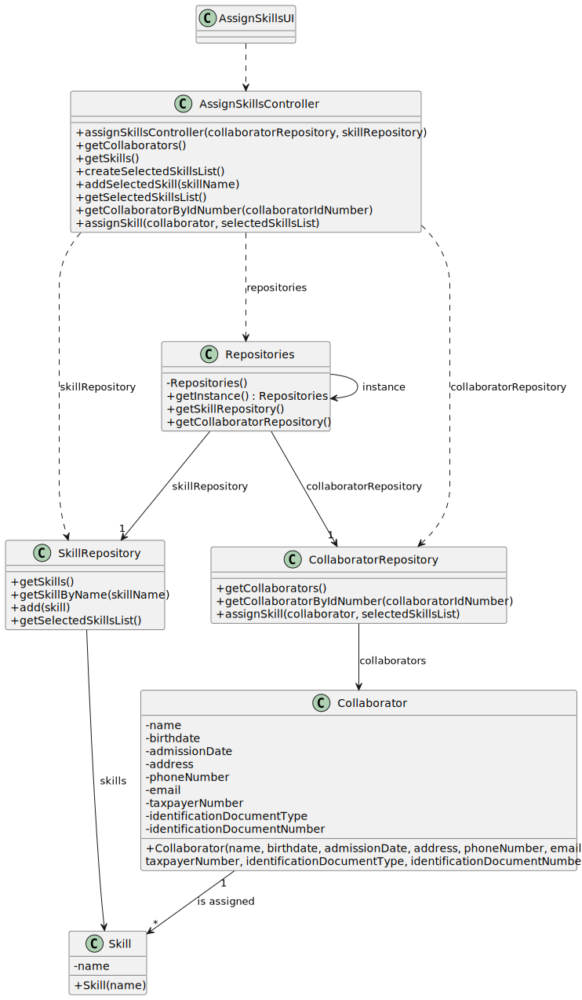

# US004 - assign one or more skills to a collaborator

## 3. Design - User Story Realization 

### 3.1. Rationale

| Interaction ID | Question: Which class is responsible for...                      | Answer                 | Justification (with patterns)   |
|:---------------|:-----------------------------------------------------------------|:-----------------------|:--------------------------------|
| Step 1         | ...interacting with the actor?                                   | AssignSkillsUI         | Pure Fabrication                |
|                | ...coordinating the US?                                          | AssignSkillsController |                                 |
| Step 2         | ...displaying the form for the actor to input collaborator's id? | AssignSkillsUI         | Pure Fabrication                |
| Step 3  	      | ...validating collaborator's id?                                 | AssignSkillsUI         | Pure Fabrication                |
| Step 4         | ...obtaining skills list?                                        | SkillRepository        |                                 |
| 	              | ...displaying skills list?                                       | AssignSkillsUI         | Pure Fabrication                |
| Step 5         | ...validating selected skill?                                    | AssignSkillsUI         | Pure Fabrication                |
|                | ...temporarily keeping the selected skill?                       | AssignSkillsUI         | Pure Fabrication                |
| Step 6         | ...displaying form for the actor to input response?	             | AssignSkillsUI         | Pure Fabrication                |              
| Step 7         | ...validating actor's response?                                  | AssignSkillsUI         | Pure Fabrication                | 
| Step 8         | ...obtaining collaborator's skills?                              | CollaboratorRepository |                                 | 
|                | ...displaying all the data before submitting?                    | AssignSkillsUI         | Pure Fabrication                |
|                | ...displaying the form for the actor to confirm?                 | AssignSkillsUI         | Pure Fabrication                |
| Step 9         | ...adding skills to collaborator?                                | CollaboratorRepository |                                 |
| Step 10        | ...informing operation success?                                  | AssignSkillsUI         | Pure Fabrication                |

### Systematization ##

According to the taken rationale, the conceptual classes promoted to software classes are: 

* Collaborator
* Skill

Other software classes (i.e. Pure Fabrication) identified: 

* AssignSkillsUI  
* AssignSkillsController
* CollaboratorRepository
* SkillRepository

## 3.2. Sequence Diagram (SD)

### Full Diagram

This diagram shows the full sequence of interactions between the classes involved in the realization of this user story.

### Split Diagrams

The following diagram shows the same sequence of interactions between the classes involved in the realization of this user story, but it is split in partial diagrams to better illustrate the interactions between the classes.

It uses Interaction Occurrence (a.k.a. Interaction Use).

**Get Task Category List Partial SD**

**Get Task Category Object**

**Get Employee**

**Create Task**

## 3.3. Class Diagram (CD)

