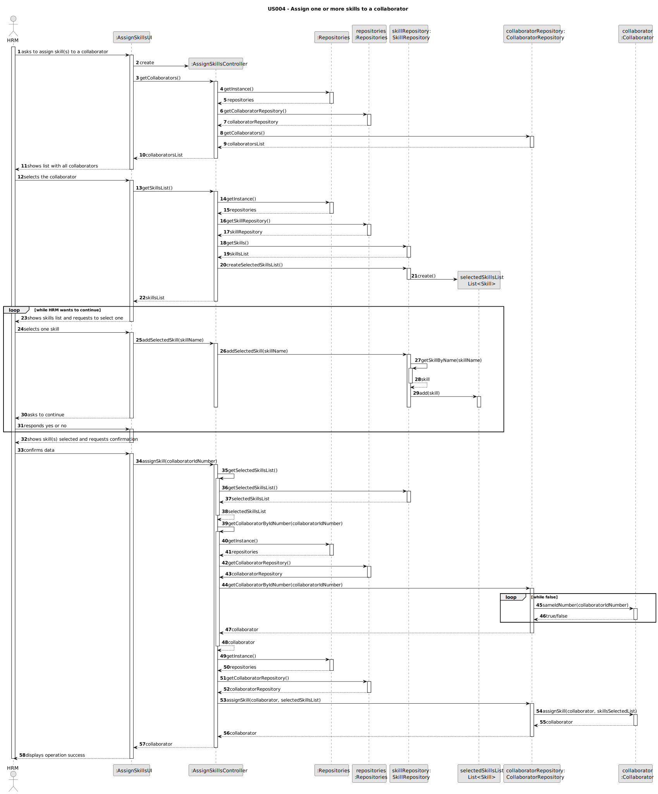
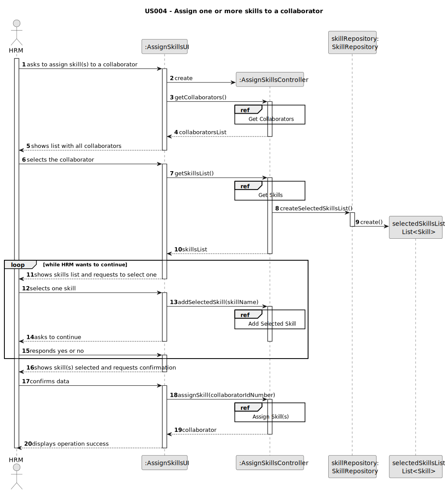
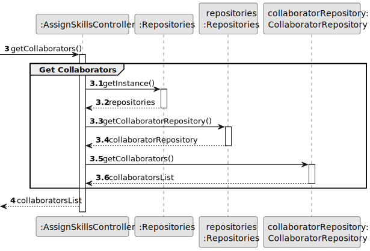
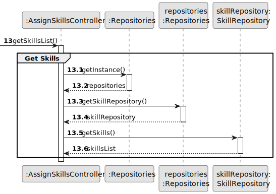
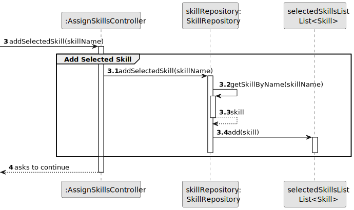
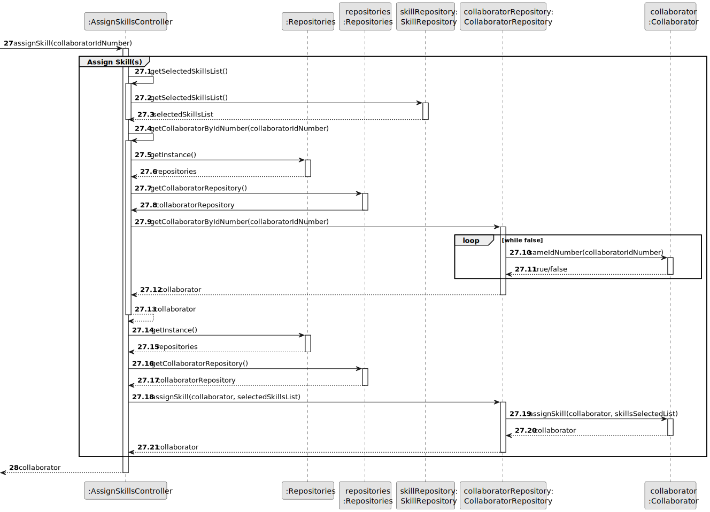

# US004 - assign one or more skills to a collaborator

## 3. Design - User Story Realization 

### 3.1. Rationale

| Interaction ID | Question: Which class is responsible for... | Answer                 | Justification (with patterns)        |
|:---------------|:--------------------------------------------|:-----------------------|:-------------------------------------|
| Step 1         | ...interacting with the actor?              | AssignSkillsUI         | Pure Fabrication                     |
|                | ...coordinating the US?                     | AssignSkillsController | Pure Fabrication, Controller         |
|                | ...obtaining the collaborators list?        | CollaboratorRepository | Pure Fabrication, Information Expert |
| Step 2         | ...displaying collaborators list?           | AssignSkillsUI         | Pure Fabrication                     |
| Step 3         | ...obtaining skills list?                   | SkillRepository        | Pure Fabrication, Information Expert |
|                | ...creating a selected skills list?         | SkillRepository        | Pure Fabrication, Creator            |
| Step 4         | ...displaying skills list?                  | AssignSkillsUI         | Pure Fabrication                     |
| Step 5         | ...adding selected skills to the list?      | SkillRepository        | Pure Fabrication, Information Expert |              
| Step 7         | ...asking the actor to stop the loop?       | AssignSkillsUI         | Pure Fabrication                     | 
| Step 8         | ...continue/breaking the loop?              | AssignSkillsUI         | Pure Fabrication                     | 
| Step 9         | ...obtaining the selected skills list?      | SkillRepository        | Pure Fabrication, Information Expert |
|                | ...obtaining the collaborator by id?        | CollaboratorRepository | Pure Fabrication, Information Expert |
|                | ...assigning skill(s) to collaborator?      | Collaborator           | Information Expert                   |
| Step 10        | ...informing operation success?             | AssignSkillsUI         | Pure Fabrication                     |

### Systematization ##

According to the taken rationale, the conceptual classes promoted to software classes are: 

* Collaborator
* Skill

Other software classes (i.e. Pure Fabrication) identified: 

* AssignSkillsUI  
* AssignSkillsController
* CollaboratorRepository
* SkillRepository

## 3.2. Sequence Diagram (SD)

### Full Diagram

This diagram shows the full sequence of interactions between the classes involved in the realization of this user story.

### Split Diagrams

The following diagram shows the same sequence of interactions between the classes involved in the realization of this user story, but it is split in partial diagrams to better illustrate the interactions between the classes.

It uses Interaction Occurrence (a.k.a. Interaction Use).

**Get Collaborators**

**Get Skills**

**Add Selected Skill**

**Assign Skill(s)**

## 3.3. Class Diagram (CD)

