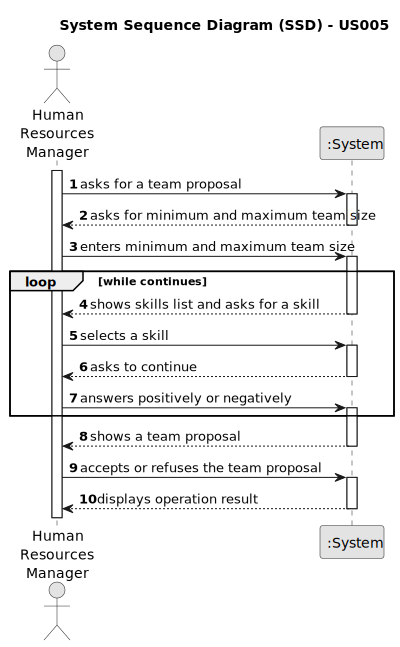

# US005 - Generate a team proposal

## 1. Requirements Engineering

### 1.1. User Story Description

As an HRM, I want to generate a team proposal automatically.

### 1.2. Customer Specifications and Clarifications 

**From the specifications document:**

>	Teams are temporary associations of employees who will carry out a set of tasks in one or more green spaces.

>   When creating multipurpose teams, the number of members and the set of skills that must be covered are crucial.

**From the client clarifications:**

> **Question:** What information will the customer provide?
>
> **Answer:** The customer provides the minimum and maximum size of the team, and a set of skills.

> **Question:** What should the output of the automation be?
> 
> **Answer:** The systems provides team proposals and HRM can accept or refuse the proposals. In the future (not in this sprint) HRM may decide to edit the team.

> **Question:** How does it generate the team if there are not enough employees?
>
> **Answer:** The system should provide information why it can't generate a team.

> **Question:** Can a collaborator be in more than one team at the same time?
>
> **Answer:** No.

> **Question:** Should there be any more information in the team generated beyond the collaborators in which it consists?
>
> **Answer:** The information should contain each of team members and its skills.
 
> **Question:** Um colaborador pode pertencer a mais que uma equipa?
>
> **Answer:** Um colaborador não pode estar em mais do que uma equipa.

### 1.3. Acceptance Criteria

* **AC1:** The minimum and maximum team size, and the set of skills need to be supplied by the HRM, like in the following example: 
4; 3; <tree pruner; tree pruner; tree pruner; light vehicle licence>
* **AC2:** Each collaborator can't belong to more than one team.
* **AC3:** The team generated should contain the selected collaborators and their skills. The HRM can refuse or accept the proposal.
* **AC4:** The system should provide the information why it can't generate the team, if that's the case.

### 1.4. Found out Dependencies

* There is a dependency on "US003 - Register a collaborator" as there must be enough collaborators to form a team.
* There is a dependency on "US004 - Assign one or more skills to a collaborator" as the collaborators must have skills assigned to them.

### 1.5 Input and Output Data

**Input Data:**

* Typed data:
    * minimum team size
    * maximum team size
    * set of skills

**Output Data:**

* List of existing skills
* Team proposal
* Insuccess of the operation (with reason why it can't generate the proposal)

### 1.6. System Sequence Diagram (SSD)

### 1.7 Other Relevant Remarks
