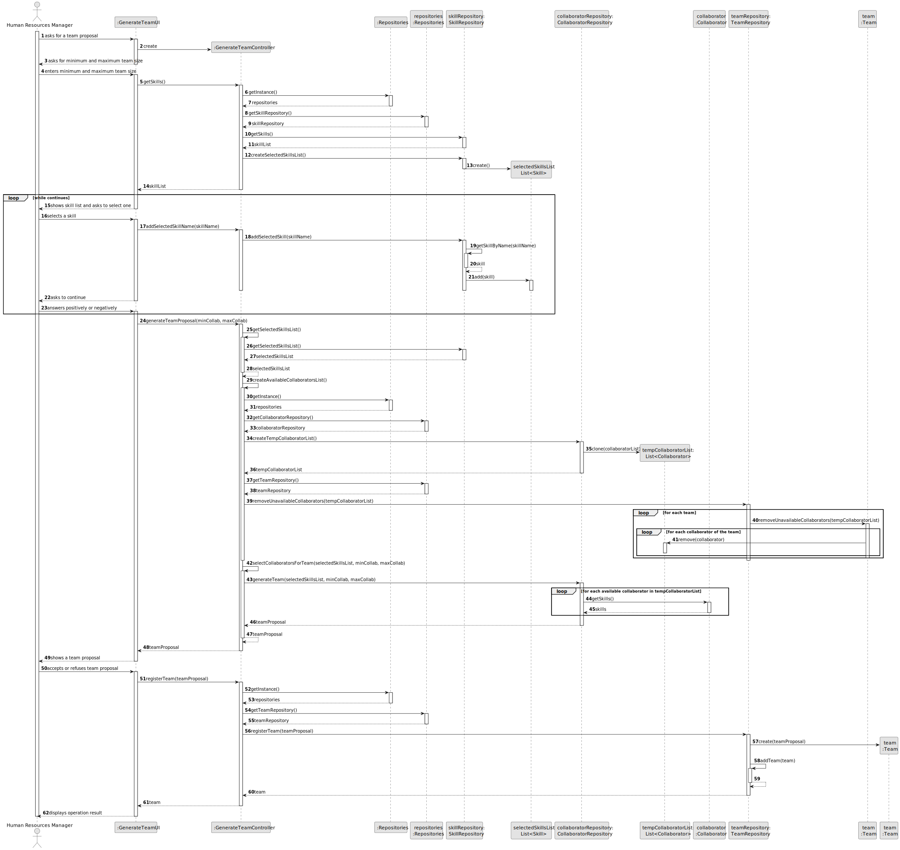
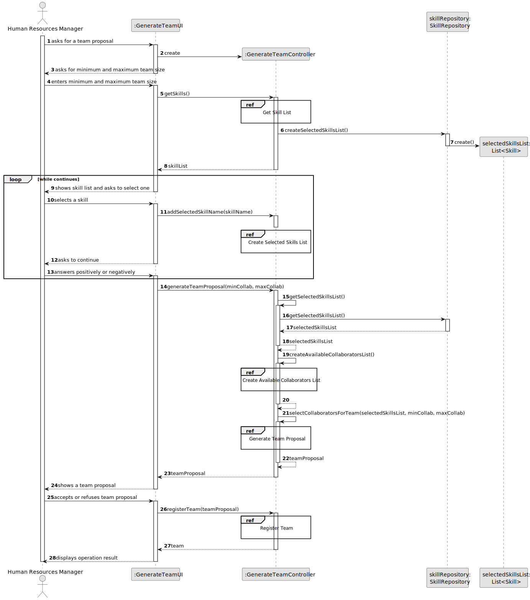
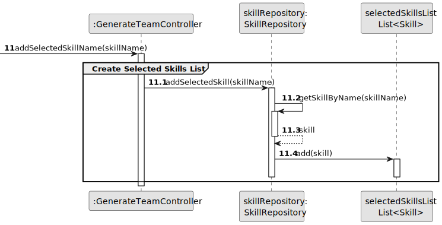
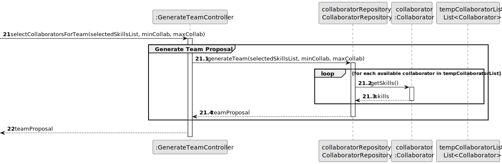
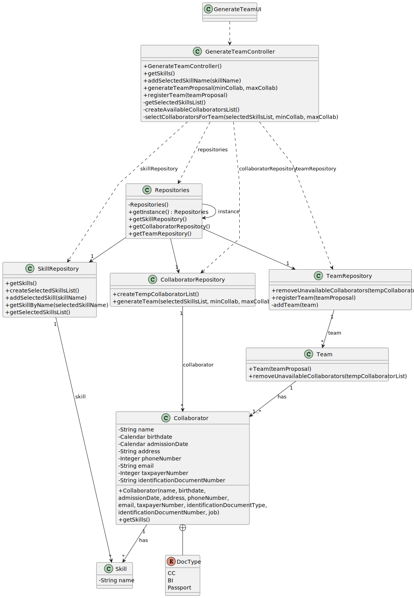

# US005 - Generate a team proposal

## 3. Design - User Story Realization 

### 3.1. Rationale

| Interaction ID | Question: Which class is responsible for...                                         | Answer                 | Justification (with patterns)                 |
|:---------------|:------------------------------------------------------------------------------------|:-----------------------|:----------------------------------------------|
| Step 1  		     | 	... interacting with the actor?                                                    | GenerateTeamUI         | Pure Fabrication                              |
|                | ... coordinating the US?                                                            | GenerateTeamController | Pure Fabrication, Controller                  |
| Step 2  		     | 	... displaying the form for the actor to input data?						                         | GenerateTeamUI         | Pure Fabrication                              |
| Step 3  		     | 	... temporarily keeping the input data?                                            | GenerateTeamUI         | Pure Fabrication                              |
|                | ... obtaining the skills list?                                                      | SkillRepository        | Pure Fabrication, Information Expert          |
|                | ... creating a list to store the skills inserted by the user?                       | SkillRepository        | Pure Fabrication, Creator                     |
| Step 4  		     | 	... displaying the skills?                                                         | GenerateTeamUI         | Pure Fabrication                              |
|                | ... displaying the text field for skill input                                       | GenerateTeamUI         | Pure Fabrication                              |
| Step 5  		     | 	... adding the skills introduced to the created list of skills?                    | SkillRepository        | Pure Fabrication, Information Expert          |
| Step 6  		     | 	... asking the actor to stop the loop?						                                       | GenerateTeamUI         | Pure Fabrication                              |              
| Step 7  		     | 	... continuing/breaking the loop?                                                  | GenerateTeamUI         | Pure Fabrication                              |
|                | ... identifying the skills by name and creating and adding them to a list of skills | SkillRepository        | Pure Fabrication, Creator, Information Expert |
|                | ... cloning the collaborators list to create a temporary list?                      | CollaboratorRepository | Pure Fabrication, Creator, Information Expert |
|                | ... removing collaborators from the list that are already on teams?                 | Team                   | Pure Fabrication, Information Expert          |
|                | ... selecting the most suitable collaborators for the team?                         | Collaborator           | Information Expert                            | |                        |                                               |
| Step 8         | ... showing the proposed team?                                                      | GenerateTeamUI         | Pure Fabrication                              |
| Step 9		       | 	... receiving the acceptance or refusal of the team?                               | GenerateTeamUI         | Pure Fabrication                              | 
|                | ... creating a team object?                                                         | TeamRepository         | Pure Fabrication, Creator                     |
| Step 10        | ... informing operation result?                                                     | GenerateTeamUI         | Pure Fabrication                              |

### Systematization ##

According to the taken rationale, the conceptual classes promoted to software classes are: 

* Team
* Collaborator

Other software classes (i.e. Pure Fabrication) identified: 

* GenerateTeamUI
* GenerateTeamController
* TeamRepository
* SkillRepository
* CollaboratorRepository

## 3.2. Sequence Diagram (SD)

### Full Diagram

This diagram shows the full sequence of interactions between the classes involved in the realization of this user story.

### Split Diagrams

The following diagram shows the same sequence of interactions between the classes involved in the realization of this user story, but it is split in partial diagrams to better illustrate the interactions between the classes.

It uses Interaction Occurrence (a.k.a. Interaction Use).

**Get Skill List**

**Create Selected Skills List**

**Create Available Collaborators List**

**Generate Team Proposal**

**Register Team**

## 3.3. Class Diagram (CD)

