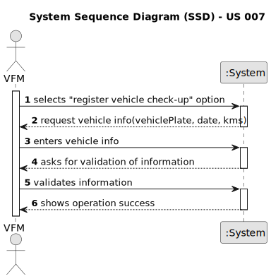

# US007 - Register a vehicle’s check-up

## 1. Requirements Engineering

### 1.1. User Story Description

- As an VFM, I wish to register a vehicle’s check-up

### 1.2. Customer Specifications and Clarifications

**From the client clarifications:**
> **Question:** Does a vehicle need to be registered in US06 before being able to go for a check up in US07?
> 
> **Answer:** Yes

> **Question:**
Good morning client,
which attributes will you need for the vehicle's check-up?
> 
> **Answer:**
Plate number, date, kms at checkup

> **Question:**
What is the unit of measurement used to estimate the check-up frequency (Kms, months, etc.)?
> 
> **Answer:**
In real context all could be considered, in the scope of this project just kms will be considered.

> **Question:** 
What information is needed when registering a vehicle for check up?
> 
> **Answer:**
Vehicle ID
Date
current kms

> **Question:**  What´s the supposed vehicle check up supposed to look like?
> 
> **Answer:**
while registering a checkup, the vehicle id, date and current kms, shoud be considered.

> **Question:**
What are the validation requirements for the vehicle ID?
Can a vehicle have more than one check-up?
> 
> **Answer:**
After 2020: AA-00-AA
between 2005-2020 00-AA-00
between 1992-2005 00-00-XX
Yes.

> **Question:** - Does the HRM need to specify the task first for the team to be generated?
Should there be a default task? If so what are the minimum characteristics(collaborators and jobs needed, time interval, green space...)?
Should the generated team be assigned the task defined/default into the to-do list?
Does and if yes which characteristics need to be taken into account to generate a team?
> 
> **Answer:**
no;
no;
no;
already answered in the forum.

### 1.3. Acceptance Criteria

* **AC1:** All required fields must be filled in.
* * **AC1:** All required fields must be filled in.

### 1.4. Found out Dependencies

* Depends of US006 as it needs a vehicle registered in the system so that a check-up must be registered
### 1.5 Input and Output Data

**Input Data:**

* Typed data:
  * VehicleId
  * Date
* Selected data:

**Output Data:**

* (In)Success of the operation

### 1.6. System Sequence Diagram (SSD)

**_Other alternatives might exist._**

#### Alternative One

### 1.7 Other Relevant Remarks
