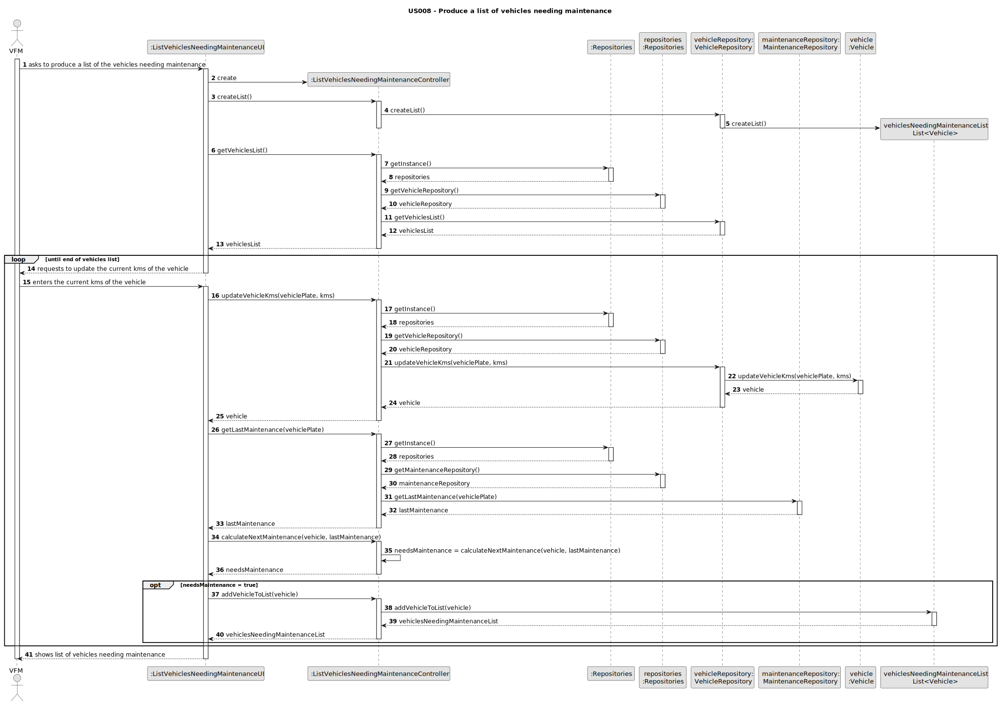
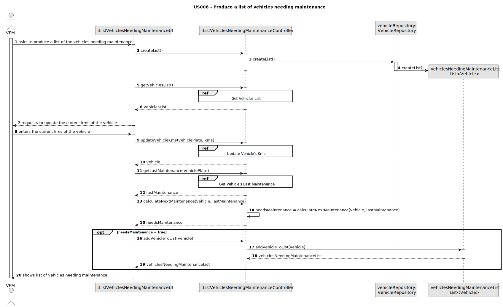
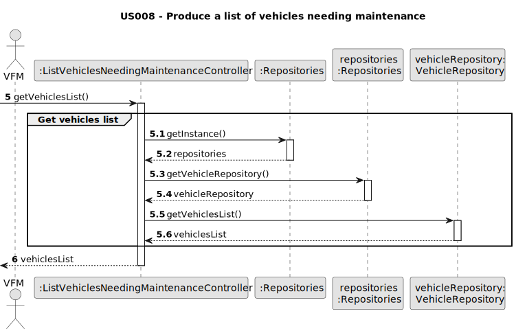
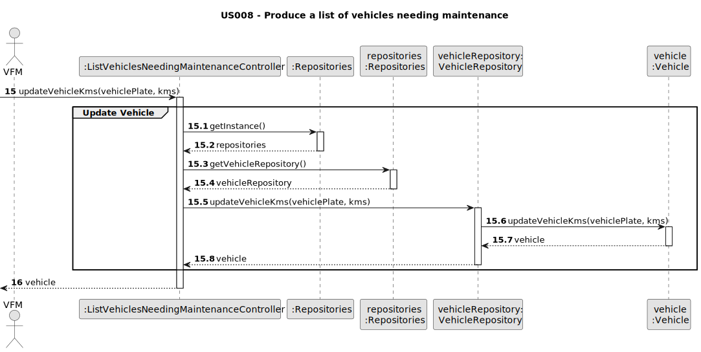
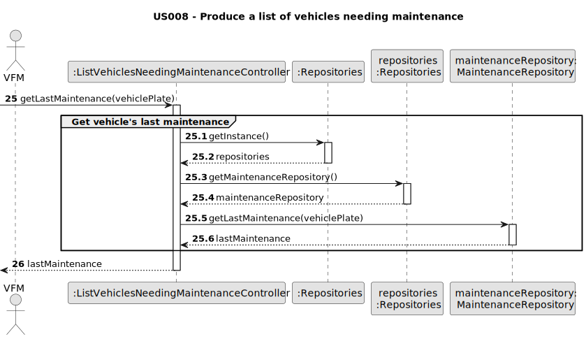
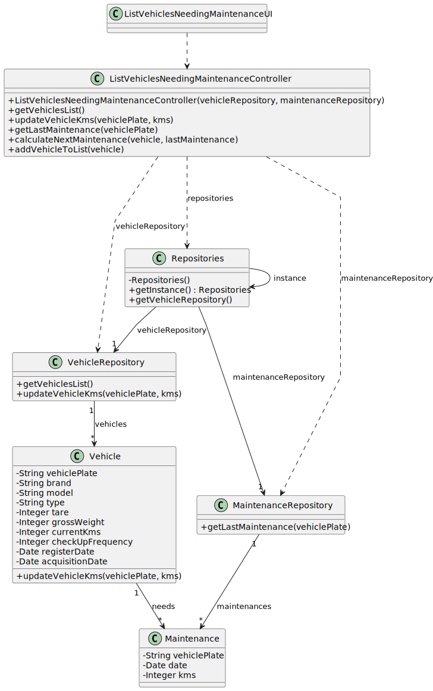

# US008 - Produce list of vehicles needing maintenance

## 3. Design - User Story Realization 

### 3.1. Rationale

| Interaction ID | Question: Which class is responsible for...                        | Answer                                       | Justification (with patterns)        |
|:---------------|:-------------------------------------------------------------------|:---------------------------------------------|:-------------------------------------|
| Step 1         | ... interacting with the actor?                                    | ListVehiclesNeedingMaintenanceUI             | Pure Fabrication                     |
| 		             | ... coordinating the US?                                           | ListVehiclesNeedingMaintenanceController     | Pure Fabrication, Controller         |
| 		             | ... creating a list to store the vehicles needing maintenance?     | VehicleRepository                            | Pure Fabrication, Creator            |
| 		             | ... obtaining the vehicles list?                                   | VehicleRepository                            | Pure Fabrication, Information Expert |
| Step 2  	      | ... displaying the text field to update vehicle's current kms?  		 | ListVehiclesNeedingMaintenanceUI             | Pure Fabrication                     |
| Step 3  	      | ... updating the vehicle's kms introduced by the user?             | Vehicle                                      | Information Expert                   |
|                | ... getting the vehicle's last maintenance?                        | MaintenanceRepository                        | Pure Fabrication, Information Expert |
|                | ... calculating vehicle's next maintenance?                        | ListVehiclesNeedingMaintenanceController     | Controller                           |
|                | ... adding vehicle to the list of vehicles needing maintenance?    | ListVehiclesNeedingMaintenanceController     | Controller                           |
| Step 4  	      | ... displaying the vehicles needing maintenance list?              | ListVehiclesNeedingMaintenanceUI             | Pure Fabrication                     |

### Systematization ##

According to the taken rationale, the conceptual classes promoted to software classes are: 

* Vehicle
* Maintenance

Other software classes (i.e. Pure Fabrication) identified: 

* ListVehiclesNeedingMaintenanceUI  
* ListVehiclesNeedingMaintenanceController
* VehicleRepository
* MaintenanceRepository

## 3.2. Sequence Diagram (SD)

### Full Diagram

This diagram shows the full sequence of interactions between the classes involved in the realization of this user story.

### Split Diagrams

The following diagram shows the same sequence of interactions between the classes involved in the realization of this user story, but it is split in partial diagrams to better illustrate the interactions between the classes.

It uses Interaction Occurrence (a.k.a. Interaction Use).

**Get Vehicles List**

**Update Vehicles**

**Get Last Maintenance**

## 3.3. Class Diagram (CD)

