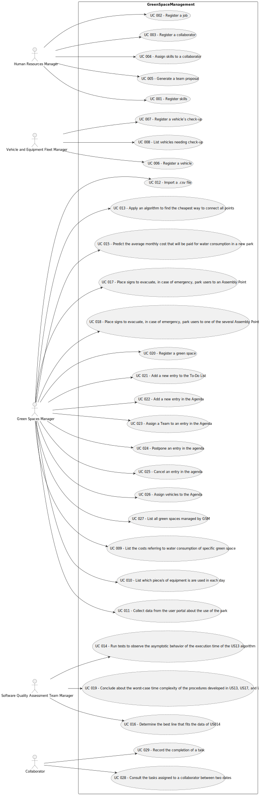

# Use Case Diagram (UCD)

# Use Cases / User Stories

| UC/US | Description                                                                             |                   
|:------|:----------------------------------------------------------------------------------------|
| US001 | [Register skills](../../us001/Readme.md)                                                |
| US002 | [Register a job](../../us002/01.requirements-engineering/Readme.md)                     |
| US003 | [Register a collaborator](../../us003/Readme.md)                                        |
| US004 | [Assign skills to a collaborator](../../us004/Readme.md)                                |
| US005 | [Generate a team proposal](../../us005/Readme.md)                                       |
| US006 | [Register a vehicle](../../us006/01.requirements-engineering/Readme.md)                 |
| US007 | [Register a vehicle’s check-up](../../us007/Readme.md)                                  |
| US008 | [List vehicles needing check-up](../../us008/Readme.md)                                 |
| US020 | [Register a green space](../../us020/Readme.md)                                         |
| US021 | [Add a new entry to the To-Do List](../../us021/Readme.md)                              |
| US022 | [Add a new entry in the Agenda](../../us022/Readme.md)                                  |
| US023 | [Assign a Team to an entry in the Agenda](../../us023/Readme.md)                        |
| US024 | [Postpone an entry in the agenda](../../us024/Readme.md)                                |
| US025 | [Cancel an entry in the agenda](../../us025/Readme.md)                                  |
| US026 | [Assign vehicles to the Agenda](../../us026/Readme.md)                                  |
| US027 | [List all green spaces managed by GSM](../../us027/Readme.md)                           |
| US028 | [Consult the tasks assigned to a collaborator between two dates](../../us028/Readme.md) |
| US029 | [Record the completion of a task](../../us029/Readme.md)                                |