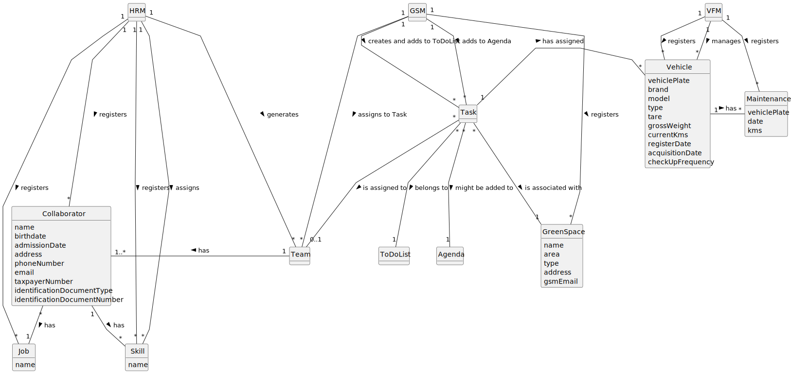

# OO Analysis

## Rationale to identify domain conceptual classes

### _Conceptual Class Category List_

**Business Transactions**

* Task

---

**Transaction Line Items**

* 

---

**Product/Service related to a Transaction or Transaction Line Item**

* Portal

---

**Transaction Records**

* To-Do List
* Agenda

---  

**Roles of People or Organizations**

* HRM (Human Resources Manager)
* VFM (Vehicle and Equipment Fleet Manager)
* Collaborator
* GSM (Green Spaces Manager)
* GSU (Green Spaces User)
* Employee

---

**Places**

* Green Space

---

**Noteworthy Events**

* Check-up

---

**Physical Objects**

* Vehicle
* Machine
* Equipment

---

**Descriptions of Things**

* Job
* Skill

---

**Catalogs**

* 

---

**Containers**

* Team

---

**Elements of Containers**

* 

---

**Organizations**

* MusgoSublime

---

**Other External/Collaborating Systems**

* 

---

**Records of finance, work, contracts, legal matters**

* 

---

**Financial Instruments**

* 

---

**Documents mentioned/used to perform some work/**

* 

---

## Rationale to identify associations between conceptual classes

| Concept (A) 		 |       Association   	        |  Concept (B) |
|----------------|:----------------------------:|-------------:|
| Task           |        is assigned to        |         Team |
| Collaborator   |            has a             |          Job |
| Collaborator   |             has              |        Skill |
| Team           |             has              | Collaborator |
| HRM            |          generates           |         Team |
| HRM            |          registers           |        Skill |
| HRM            |          registers           |          Job |
| HRM            |          registers           | Collaborator |
| HRM            |           assigns            |        Skill |
| VFM            |           manages            |      Vehicle |
| VFM            |          registers           |      Vehicle |
| VFM            |          registers           |     Check-up |
| Task           |         has assigned         |      Vehicle |
| Vehicle        |             has              |     Check-up |
| Task           |        is associated         |  Green Space |
| Task           |          belongs to          |   To-Do List |
| Task           |      might be added to       |       Agenda |
| GSM            |          registers           |  Green Space |
| GSM            | creates and adds to ToDoList |         Task |
| GSM            |        adds to Agenda        |         Task |
| GSM            |       assigns to task        |         Team |

## Domain Model

