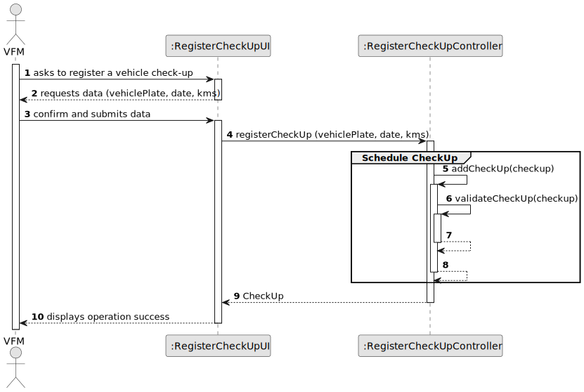
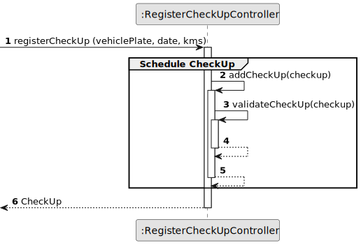
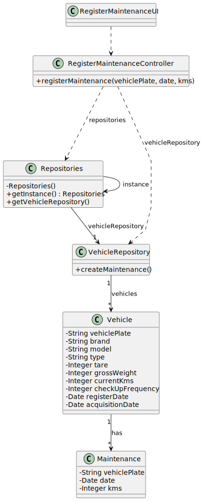

# US07 - Register a Vehicle’s Check-Up

## 3. Design - User Story Realization

### 3.1. Rationale

| Interaction ID | Question: Which class is responsible for...   | Answer                        | Justification (with patterns)                                                                                 |
|:---------------|:----------------------------------------------|:------------------------------|:--------------------------------------------------------------------------------------------------------------|
| Step 1  		     | 	... interacting with the actor?              | RegisterMaintenanceUI         | Pure Fabrication: there is no reason to assign this responsibility to any existing class in the Domain Model. |
| 			  		        | 	... coordinating the US?                     | RegisterMaintenanceController | Controller                                                                                                    |
| 			  		        | 	... instantiating a new Maintenance?         | Collaborator                  | Pure Fabrication.                                                                                             |
| 			  		        | ... knowing the user using the system?        | UserSession                   | IE: cf. A&A component documentation.                                                                          |
| 			  		        | 							                                       | Organization                  | IE: knows/has its own Collaborators                                                                           |
| 			  		        | 							                                       | Collaborator                  | IE: knows its own data vehiclePlat, date, kms)                                                                |
| Step 2  		     | 							                                       |                               |                                                                                                               |
| Step 3  		     | 	...saving the inputted data?                 | VehicleRepository             | Pure Fabrication                                                                                              |
| Step 4  		     | 	... saving the selected category?            | Vehicle                       | IE: object created in step 1 is classified in one Category.                                                   |
| Step 5  		     | 							                                       |                               |                                                                                                               |              
| Step 6  		     | 	... validating all data (local validation)?  | Maintenance                   | IE: owns its data.                                                                                            | 
| 			  		        | 	... validating all data (global validation)? | Collaborator                  | IE: knows all its vehicles.                                                                                   | 
| 			  		        | 	... saving the created maintenance?          | VehicleRepository             | IE: stores all vehicles                                                                                       | 
| Step 7         | ...adding skill to repository                 | VehicleRepository             | Pure Fabrication                                                                                              |
| Step 8  		     | 	... informing operation success?             | RegisterMaintenanceUI         | IE: is responsible for user interactions.                                                                     | 

### Systematization ##

According to the taken rationale, the conceptual classes promoted to software classes are:

* Vehicle
* Maintenance

Other software classes (i.e. Pure Fabrication) identified:

* RegisterMaintenanceUI
* RegisterMaintenanceController
* VehicleRepository

## 3.2. Sequence Diagram (SD)

### Full Diagram

This diagram shows the full sequence of interactions between the classes involved in the realization of this user story.

### Split Diagrams

The following diagram shows the same sequence of interactions between the classes involved in the realization of this user story, but it is split in partial diagrams to better illustrate the interactions between the classes.

It uses Interaction Occurrence (a.k.a. Interaction Use).

## 3.3. Class Diagram (CD)

