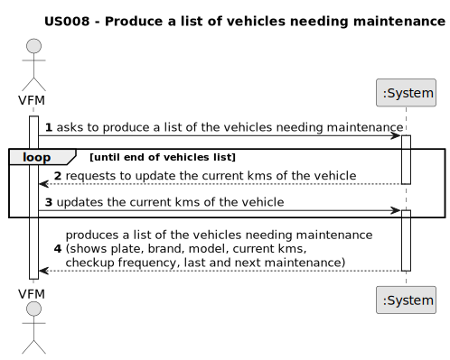

# US008 - Produce list of vehicles needing maintenance

## 1. Requirements Engineering

### 1.1. User Story Description

As a VFM, I want the system to produce a list (report) of vehicles needing maintenance.

### 1.2. Customer Specifications and Clarifications 

**From the client clarifications:**

> **Question:** Can the vehicles get placed automatically on a list or the one listing has to be the FM?
>
> **Answer:** the list of vehicles is automatically created but the creation is triggered by the FM.

> **Question:** What information will appear on the final list regarding the vehicle,besides the needing for check-up?
> 
> **Answer:** Data that allow to identify the vehicle like Plate, brand and modle, as well as, the data that allowed to select/insert te vehicle in the list, number of kms, frequecny of checkup and the last checkup.

> **Question:** What are the requests/ input data to list the vehicles needing the check-up? Type of vehicle, Current Km and Maintenance/Check-up Frequency (in Kms) are sufficient?  Are there acceptance criteria when asking for the list?
>
> **Answer:** Current Km and Maintenance/Check-up Frequency (in Kms) are sufficient, yes;
> The list must contain all vehicles that have already exceeded the number of km required for the inspection or those that are close to it.
> For example:
> a vehicle that made the checkup at 23500 and has a checkup frequency of 10000km. 
> a) If it currently has 33600 (exceeded) or 
> b) 33480 (there is a difference minor than 5% of the number of kms of the checkup frequency).
> The list must clearly identify the vehicles through: plate number, brand, model and the that justified the checkup need.

> **Question:** I'm not sure if I understood everything about US08. In this US we should only list the vehicles that need a check up (surpass the check up frequency in KM)
> or that will shortly need a check up (5% to the check up frequency *already said in another post*), correct? If so, the information about the checkup frequency for each vehicle should be asked in US07?
>
> **Answer:**
> - No; the Maintenance/Check-up Frequency (in km) is registered in US06.

### 1.3. Acceptance Criteria

* AC1: The report should have the data concerning the vehicle description (Plate, Brand, Model and Current Kms) and the Checkup related data

### 1.4. Found out Dependencies

* There is a dependency on "US006 - Register a vehicle" as there must be at least one vehicle.
* There is a dependency on "US007 - Register a vehicle's maintenance" as there must be at least one vehicle's maintencance.

### 1.5 Input and Output Data

**Input Data:**

* Typed data:
    * current kms of each vehicle

**Output Data:**

* List of vehicles needing the check-up

### 1.6. System Sequence Diagram (SSD)

### 1.7 Other Relevant Remarks

* There are no other relevant remarks for this user story.