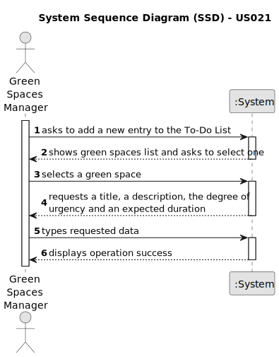

# US021 - Add a new entry to the To-Do List

## 1. Requirements Engineering

### 1.1. User Story Description

As a GSM, I want to add a new entry to the To-Do List.

### 1.2. Customer Specifications and Clarifications

**From the specifications document:**

>   The To-Do List comprises all the tasks required to
be done in order to assure the proper functioning of the parks. These tasks
can be regular (e.g. pruning trees) or occasional (e.g. repairing a broken
equipment). They may also require a multidisciplinary team and the length
of the task can vary from a few minutes (e.g. replacing a light bulb) to weeks
(e.g. installing an irrigation system).

>	The To-Do List comprises all pending tasks for all parks. The entries in
this list describe the required task, the degree of urgency (High, Medium,
and Low), and the approximate expected duration.

**From the client clarifications:**

> **Question:** If there are multiple GSM in the system, can a GSM create an entry for a Green Space managed by another GSM?
>
> **Answer:** No.

> **Question:** For a regular task, should the GSM define the frequency in which the tasks need to be performed?
>
> **Answer:** Not for this sprint.

> **Question:** Should the to-do entries be unique or can a GSM repeat the same to-do entry, for the same Green Space, multiple times?
>
> **Answer:** Yes. Assuming the previous task with same description was previously processed and is not open anymore.

> **Question:** If the To-Do entry is assigned to the Agenda, should it be removed for the To-Do entry, if it's only occasional?
>
> **Answer:** Should change the status to processed.

> **Question:** What are the details the GSM needs to input, other than the Green Space, frequency, estimated duration? Title and description are required?
>
> **Answer:** Title and description could be useful.

> **Question:** Should the GSM define the skills needed for a To-Do entry?
>
> **Answer:** No, but maybe it should be done for type of task (or similar).

> **Question:** Are the new entries on the list divided in categories? For example, the statement talks about regular and occasional tasks, should the distinction be made for the user?
>
> **Answer:** In the scope of the current proof-of-concept, there are no user stories using that categories.

> **Question:** Finally, during the last client meeting, we became aware that some tasks are meant to be reoccurring rather than occasional. Is this something that should be asked on creating the task in the to-do list? If so, what inputs should we expect from the user? The task's frequency in days?
>
> **Answer:** For the current proof-of-concept there is no need to distinguish between recurring and occasional tasks.

> **Question:** And when it comes to To-Do List entries, we identified a state (planned, postponed, completed, canceled), a green space, a title, and a description as inputs for a To-Do List entry. But are there any more?
>
> **Answer:** In the text you can find: the degree of urgency (High, Medium,and Low), and the approximate expected duration.

> **Question:** We also know that an Agenda entry has a target date, but is this target date supposed to be inputted upon transferring a task from the to-do list to the agenda, or is it supposed to be inputted upon creating the task in the to-do list?
>
> **Answer:** To-do list entries doesn't have dates!

> **Question:** When a new entry is added to the ToDo list, the default status of that task will be "pending" or no status at all is considered on ToDo list?
>
> **Answer:** "Pending" as default for to-do list entries, sounds good.

> **Question:** Hello. My question is how the code is supposed to know what GSM the user is? By an already logged-in email? Or I have to make the machine ask for confirmation? Is the machine supposed to filter the green spaces the GSM manages in to avoid mistaking one for another?
>
> **Answer:** I have no knowledge about how to code! I suppose it's a matter of UX/UI, so each dev team can decide about it.

> **Question:** Is it mandatory for the program to have multiple GSM? If so, should each green space be associated with a responsible GSM? In other words, can only the GSM assigned to a specific green space register a new entry for the to-do list?
>
> **Answer:** The program can have multiple GSM. Yes. Yes.

> **Question:** What time unit should be used for the duration of the task?
>
> **Answer:** Hours and/or days.

### 1.3. Acceptance Criteria

* **AC1:** The new entry must be associated with a green space managed by the GSM.
* **AC2:** The green space for the new entry should be chosen from a list presented to the GSM.
* **AC3:** The expected duration is measured in hours and/or days.
* **AC4:** The default status of an entry in the To-Do list is "Pending" and when it is assigned to the Agenda should change to "Processed".
* **AC5:** The title, description, degree of urgency, expected duration and green space should be provided by the GSM.

### 1.4. Found out Dependencies

* There is a dependency on "US020 - Register a green space" as there must be at least one green space to be associated to the new entry.

### 1.5 Input and Output Data

**Input Data:**

* Typed data:
  * a title
  * a description
  * degree of urgency
  * expected duration

* Selected data:
  * a green space

**Output Data:**

* List of existing green spaces
* (In)Success of the operation

### 1.6. System Sequence Diagram (SSD)

### 1.7 Other Relevant Remarks
Entries should have states defined by the system, no need to ask them to the user.