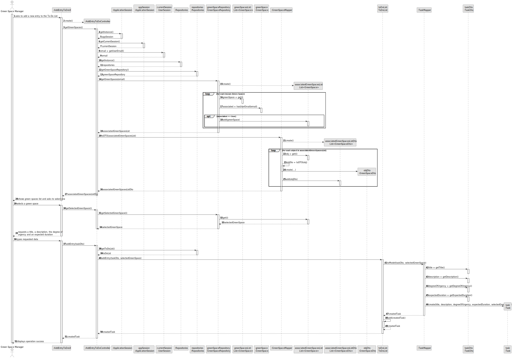
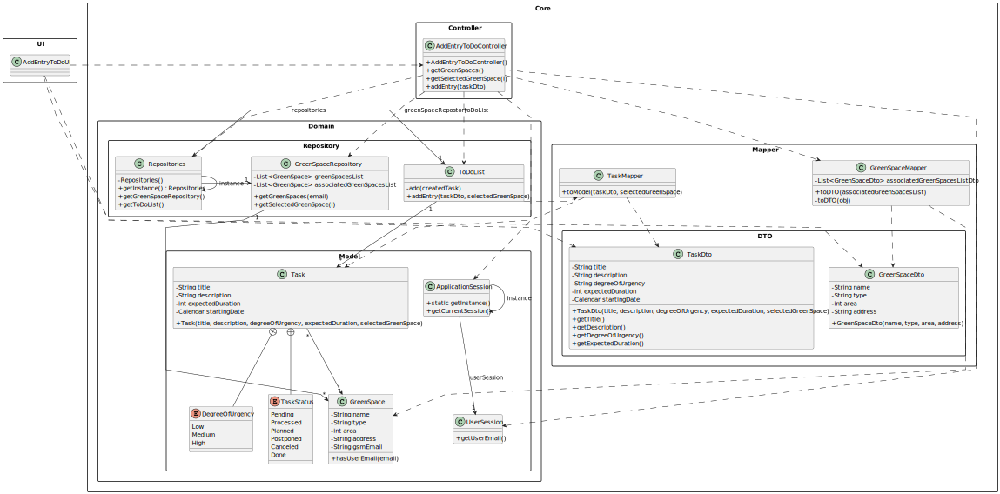

# US021 - Add a new entry to the To-Do List

## 3. Design - User Story Realization

### 3.1. Rationale

| Interaction ID | Question: Which class is responsible for...           | Answer                 | Justification (with patterns)        |
|:---------------|:------------------------------------------------------|:-----------------------|:-------------------------------------|
| Step 1  		     | 	... interacting with the actor?                      | AddEntryToDoUI         | Pure Fabrication                     |
|                | ... coordinating the US?                              | AddEntryToDoController | Pure Fabrication, Controller         |
|                | ... knowing the GSM using the system?                 | UserSession            | Information Expert                   |
|                | ... knowing to which GSM belongs?                     | GreenSpace             | Information Expert                   |
| 			  		        | 	... obtaining the green spaces list?                 | GreenSpaceRepository   | Pure Fabrication, Information Expert |
|                | ... converting the green spaces list into DTO?        | GreenSpaceMapper       | Pure Fabrication, Information Expert |
| Step 2  		     | ... displaying the green spaces?						                | AddEntryToDoUI         | Pure Fabrication                     |
| Step 3  		     | 	... identifying the selected green space?            | GreenSpaceRepository   | Pure Fabrication, Information Expert |
| Step 4  		     | 	... displaying the form for the actor to input data? | AddEntryToDoUI         | Pure Fabrication                     |
| Step 5  		     | 	... converting DTO into a domain object?             | TaskMapper             | Pure Fabrication, Information Expert |
|                | ... saving the created entry?                         | ToDoList               | Creator (R: 1, 2)                    |
|                | ... validating all data (local validation)?           | Task                   | Information Expert                   |
| Step 6  		     | 	... informing operation success? 	                   | AddEntryToDoUI         | Pure Fabrication                     |

### Systematization ##

According to the taken rationale, the conceptual classes promoted to software classes are:

* Task
* ToDoList
* GreenSpace

Other software classes (i.e. Pure Fabrication) identified:

* AddEntryToDoUI
* AddEntryToDoController
* GreenSpaceRepository
* GreenSpaceMapper
* TaskMapper

## 3.2. Sequence Diagram (SD)

### Full Diagram

This diagram shows the full sequence of interactions between the classes involved in the realization of this user story.

### Split Diagrams

The following diagram shows the same sequence of interactions between the classes involved in the realization of this user story, but it is split in partial diagrams to better illustrate the interactions between the classes.

It uses Interaction Occurrence (a.k.a. Interaction Use).

**Get Job List**

**Get Job Object**

**Register Collaborator**

## 3.3. Class Diagram (CD)

