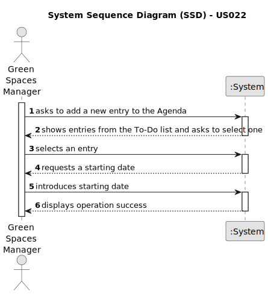

# US022 - Add a new entry in the Agenda

## 1. Requirements Engineering

### 1.1. User Story Description

- As a GSM, I want to add a new entry in the Agenda.

### 1.2. Customer Specifications and Clarifications

**From the specifications document:**

>   The Agenda is made
up of entries that relate to a task (which was previously in the To-Do List),
the team that will carry out the task, the vehicles/equipment assigned to
the task, expected duration, and the status (Planned, Postponed, Canceled,
Done).

>	Comparatively analyzing the Agenda entries and the
pending tasks (To-Do List) allows you to evaluate the work still to be done,
the busyness of the week, and the work performed by a team in a green space
at a determined time interval and on a specific date.

**From the client clarifications:**

> **Question:** When a new entry is added to the Agenda, the status of that task will be, by default, set to "planned", right?
>
> **Answer:** "Planned" as default for Agenda entries, sounds good.

> **Question:** When the GSM plans a task (that was previously in To-Do) into the Agenda, what aditional data/information does he need to input when planning?
>
> **Answer:** The starting date for the task. Later the GSM will be able to add the Team and vehicles (if required).

> **Question:** Can I add an entry that has a time period that already have an existing entry in the Agenda?
>
> **Answer:** Yes, because:
a) there are many parks to manage;
b) different tasks can be executed at same time in the same park;

### 1.3. Acceptance Criteria

* **AC1:** The new entry must be associated with a green space managed by the GSM.
* **AC2:** The new entry must exist in the To-Do list.
* **AC3:** The default status of an entry in the Agenda is "Planned".
* **AC4:** The entry on the To-Do list and the starting date should be provided by the GSM.

### 1.4. Found out Dependencies

* There is a dependency on "US021 - Add a new entry to the To-Do List" as the new entry must exist in the To-Do list.

### 1.5 Input and Output Data

**Input Data:**

* Typed data:
  * a starting date

* Selected data:
  * an entry from the To-Do List

**Output Data:**

* List of existing entries in the To-Do List
* (In)Success of the operation

### 1.6. System Sequence Diagram (SSD)

### 1.7 Other Relevant Remarks