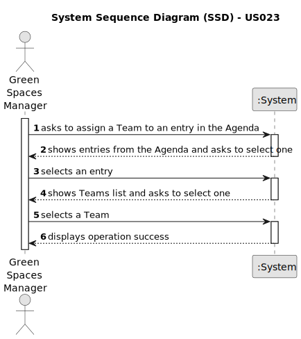

# US023 - Assign a Team to an entry in the Agenda

## 1. Requirements Engineering

### 1.1. User Story Description

As a GSM, I want to assign a Team to an entry in the Agenda.

### 1.2. Customer Specifications and Clarifications

**From the specifications document:**

>  The Agenda is made
up of entries that relate to a task (which was previously in the To-Do List),
the team that will carry out the task, the vehicles/equipment assigned to
the task, expected duration, and the status (Planned, Postponed, Canceled,
Done).

**From the client clarifications:**

> **Question:** Can a Team be assigned to multiple entries?
>
> **Answer:** Yes.

> **Question:** Can an Agenda entry have more than one team assigned to it?
>
> **Answer:** No.

> **Question:** When the task is created, the GSM must input the estimated execution time (which can be in days and/or hours and/or minutes). If he inputs, for example, "2 Days + 2 hours," does that mean 24 + 24 + 2 hours of work for that task, or does each workday have a fixed number of hours, for example, 8h + 8h + 2h?
>
> **Answer:** Working days should be considered; the duration of a working day could be defined as a configuration at bootstrap.

> **Question:** When the task enters in Agenda and the execution date is set, nothing is referenced regarding at what time the task execution starts. In this sense, although we have the start date of the task execution, we don't have the time it starts, so we can't calculate the team's availability accurately.
>
> **Answer:** The GSM can insert the date and the starting time for the task in the agenda.

> **Question:** So, how are we supposed to evaluate the team's availability? Regardless of what time the task finishes, a team cannot have more than one task on the same day? In other words, if it's to start a new task, it will have to be the next day?
>
> **Answer:** In terms of planning, the expected duration of the task should be considered, as soon a collaborator states the task is completed, the team is free.

### 1.3. Acceptance Criteria

* **AC1:** A message must be sent to all team members informing them about the assignment.
* **AC2:** Different email services can send the message. These services must be defined through a configuration file to allow the use of different platforms (e.g. Gmail, DEI’s email service, etc.).
* **AC3:** The Team and the entry in the agenda must be selected by the GSM.

### 1.4. Found out Dependencies

* There is a dependency on "US022 - Add a new entry in the Agenda." as there must be at least one entry in the agenda.

### 1.5 Input and Output Data

**Input Data:**

* Selected data:
  * a team
  * an entry from the Agenda

**Output Data:**

* List of existing entries in the Agenda
* List of existing teams
* (In)Success of the operation

### 1.6. System Sequence Diagram (SSD)

### 1.7 Other Relevant Remarks