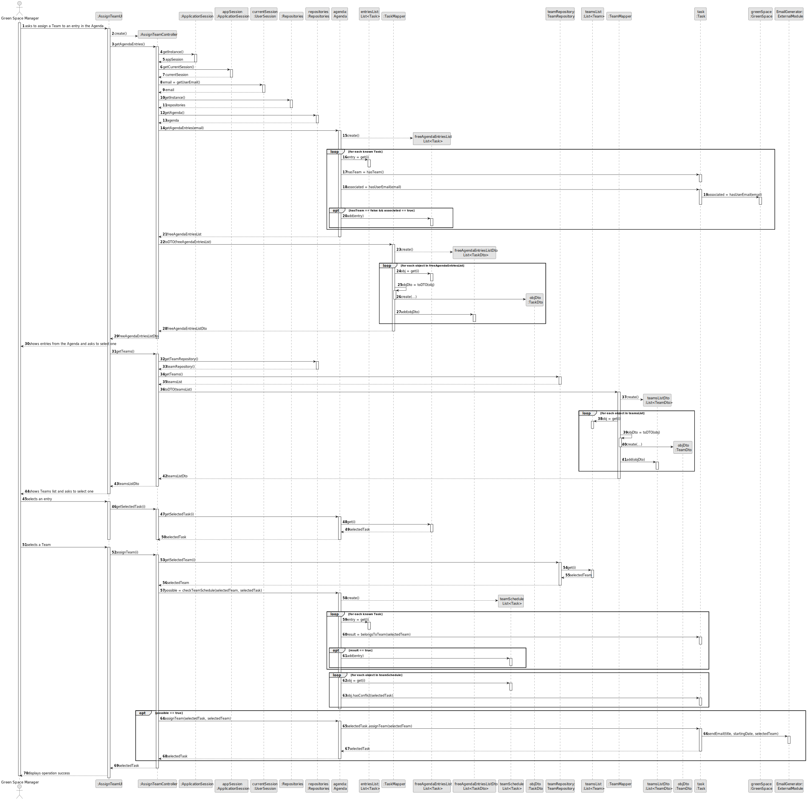

# US023 - Assign a Team to an entry in the Agenda

## 3. Design - User Story Realization

### 3.1. Rationale

| Interaction ID | Question: Which class is responsible for...               | Answer               | Justification (with patterns)             |
|:---------------|:----------------------------------------------------------|:---------------------|:------------------------------------------|
| Step 1  		     | 	... interacting with the actor?                          | AssignTeamUI         | Pure Fabrication                          |
|                | ... coordinating the US?                                  | AssignTeamController | Pure Fabrication, Controller              |
|                | ... knowing the GSM using the system?                     | UserSession          | Information Expert                        |
|                | ... knowing to which GSM belongs the entry?               | GreenSpace           | Information Expert                        |
|                | ... knowing if entry already has a team?                  | Task                 | Information Expert                        |
| 			  		        | 	... obtaining the Agenda entries?                        | Agenda               | Information Expert                        |
|                | ... converting the entries list into DTO?                 | TaskMapper           | Pure Fabrication, Information Expert, DTO |
| Step 2  		     | ... displaying the Agenda entries?						                  | AssignTeamUI         | Pure Fabrication                          |
| Step 3  		     | 	... identifying the selected Task?                       | Agenda               | Information Expert                        |
|                | ... obtaining the Teams?                                  | TeamRepository       | Pure Fabrication, Information Expert      |
|                | ... converting the teams list into DTO?                   | TeamMapper           | Pure Fabrication, Information Expert, DTO |
| Step 4  		     | 	... displaying the Teams?                                | AssignTeamUI         | Pure Fabrication                          |
| Step 5  		     | 	... identifying the selected team?                       | TeamRepository       | Pure Fabrication, Information Expert      |
|                | ... checking if the task belongs to the selected team?    | Task                 | Information Expert                        |
|                | ... checking if there are conflicts with team's schedule? | Task                 | Information Expert                        |
|                | ... saving the edited entry?                              | Agenda               | Creator                                   |
|                | ... sending message through email?                        | Email Generator      | Adapter                                   |
| Step 6  		     | 	... informing operation success? 	                       | AssignTeamUI         | Pure Fabrication                          |

### Systematization ##

According to the taken rationale, the conceptual classes promoted to software classes are:

* Task
* Agenda
* GreenSpace
* Email Generator

Other software classes (i.e. Pure Fabrication) identified:

* AssignTeamUI
* AssignTeamController
* TaskMapper
* TeamRepository
* TeamMapper

## 3.2. Sequence Diagram (SD)

### Full Diagram

This diagram shows the full sequence of interactions between the classes involved in the realization of this user story.

### Split Diagrams

The following diagram shows the same sequence of interactions between the classes involved in the realization of this user story, but it is split in partial diagrams to better illustrate the interactions between the classes.

It uses Interaction Occurrence (a.k.a. Interaction Use).

**Get Job List**

**Get Job Object**

**Register Collaborator**

## 3.3. Class Diagram (CD)

