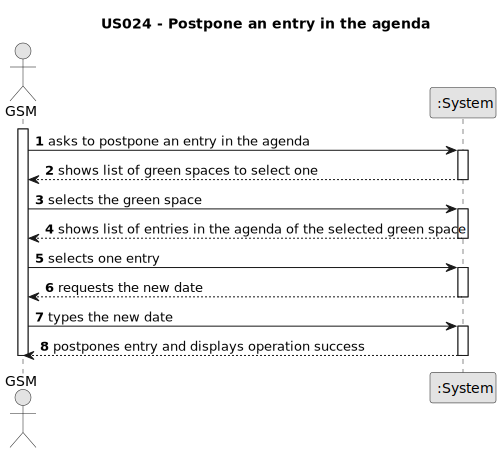

# US024 - Postpone an entry in the Agenda

## 1. Requirements Engineering

### 1.1. User Story Description

As a GSM, I want to postpone an entry in the Agenda to a future date.

### 1.2. Customer Specifications and Clarifications 

**From the specifications document:**

//TODO

**From the client clarifications:**

//TODO

### 1.3. Acceptance Criteria

* There's no acceptance criteria defined for this user story.

### 1.4. Found out Dependencies

* There is a dependency on "US022 - Add a new entry in the agenda" as there must be at least one entry to be able to postpone it.

### 1.5 Input and Output Data

**Input Data:**

* Typed data:
    * entry's new date

* Selected data:
  * a green space
  * an entry

**Output Data:**

* List of green spaces
* List of green spaces' entries
* (In)Success of the operation

### 1.6. System Sequence Diagram (SSD)

### 1.7 Other Relevant Remarks

* There are no other relevant remarks for this user story.