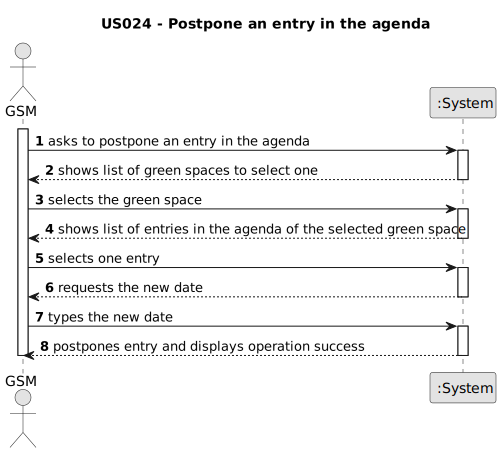

# US024 - postpone an entry in the agenda

## 1. Requirements Engineering

### 1.1. User Story Description

As a GSM, I want to postpone an entry in the Agenda to a future date.

### 1.2. Customer Specifications and Clarifications 

**From the client clarifications:**

> **Question:** The selected task(s) will be postponed by one interval defined by the user or for the next day??
>
> **Answer:** When postponing a task, the new predicated date for execution should be inserted.

> **Question:**
As a GSM, I want to Postpone an entry in the Agenda to a future date.
The date you want to postpone in this US24 is the date referring to the "approximate expected duration" field when we registered the task?
>
> **Answer:** No; sometimes, for various reasons (e.g. insufficient staff, faulty equipment or adverse weather conditions) a task has to be postponed to a new date; task duration is not directly related to this.
 

### 1.3. Acceptance Criteria

* **AC1:** It should not be able to postpone an entry that is done.

### 1.4. Found out Dependencies

* There is a dependency on "US022 - Add a new entry in the agenda" as there must be at least one entry to be able to postpone it.

### 1.5 Input and Output Data

**Input Data:**

* Typed data:
    * entry's new date

* Selected data:
  * a green space
  * an entry

**Output Data:**

* List of green spaces
* List of green spaces' entries
* (In)Success of the operation

### 1.6. System Sequence Diagram (SSD)

### 1.7 Other Relevant Remarks

* There are no other relevant remarks for this user story.