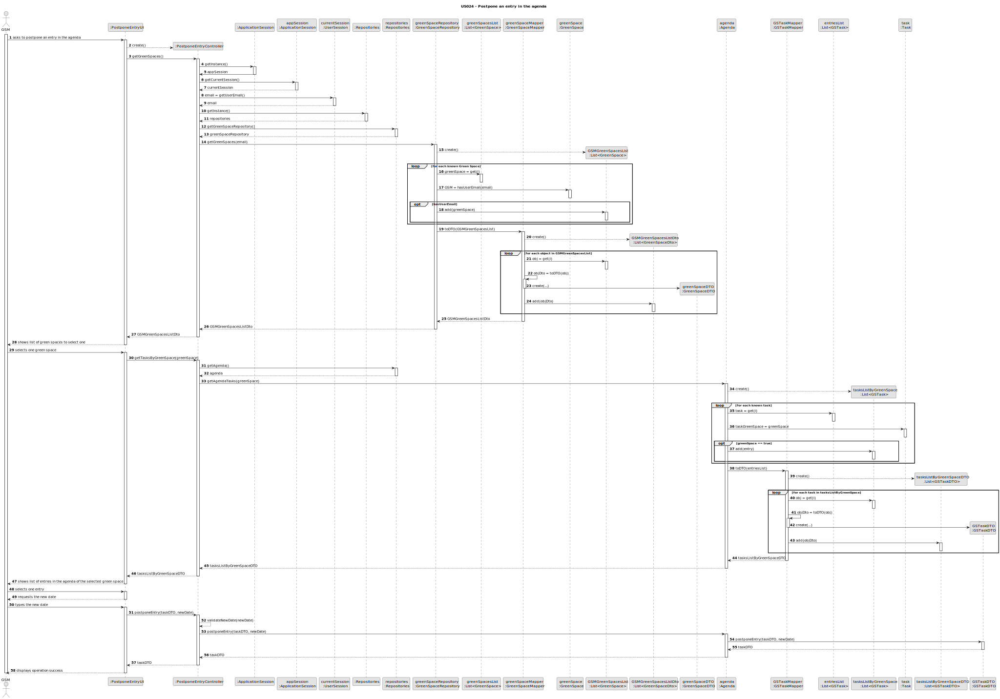
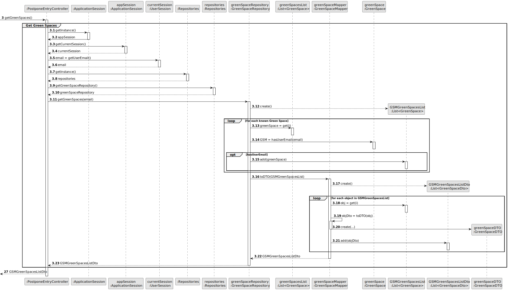
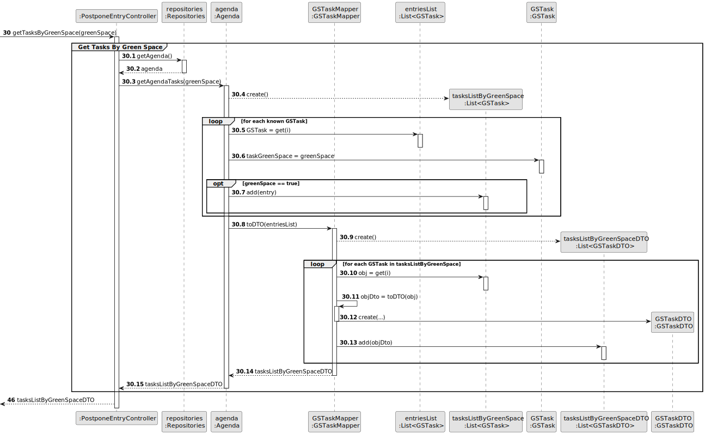
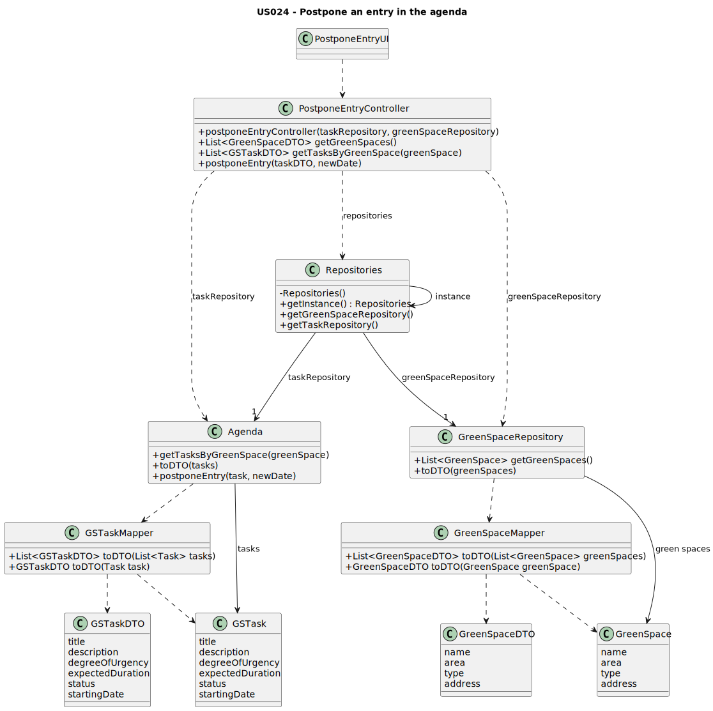

# US024 - postpone an entry in the agenda

## 3. Design - User Story Realization 

### 3.1. Rationale

| Interaction ID | Question: Which class is responsible for...                      | Answer                  | Justification (with patterns)             |
|:---------------|:-----------------------------------------------------------------|:------------------------|:------------------------------------------|
| Step 1         | ...interacting with the actor?                                   | PostponeEntryUI         | Pure Fabrication                          |
|                | ...coordinating the US?                                          | PostponeEntryController | Pure Fabrication, Controller              |
|                | ...obtaining the green spaces list?                              | GreenSpaceRepository    | Pure Fabrication, Information Expert      |
| Step 2         | ...displaying green spaces list?                                 | PostponeEntryUI         | Pure Fabrication                          |
| Step 3         | ...obtaining tasks by green space?                               | Agenda                  | Pure Fabrication, Information Expert      |
| Step 4         | ...displaying entries in the agenda of the selected green space? | PostponeEntryUI         | Pure Fabrication                          |
| Step 5         | ...saving the selected entry?                                    | PostponeEntryUI         | Pure Fabrication                          |              
| Step 6         | ...requesting the new date?                                      | PostponeEntryUI         | Pure Fabrication                          | 
| Step 7         | ...postponing requested entry?                                   | TaskRepository          | Pure Fabrication, Information Expert      | 
| Step 8         | ...informing operation success?                                  | PostponeEntryUI         | Pure Fabrication                          |

### Systematization ##

According to the taken rationale, the conceptual classes promoted to software classes are: 

* Task
* Green Space

Other software classes (i.e. Pure Fabrication) identified: 

* PostponeEntryUI  
* PostponeEntryController
* TaskRepository
* GreenSpaceRepository
* Agenda

## 3.2. Sequence Diagram (SD)

### Full Diagram

### Split Diagrams

**Get Green Spaces**

**Get Tasks by Green Space**

## 3.3. Class Diagram (CD)

