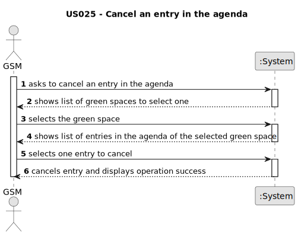

# US025 - cancel an entry in the agenda

## 1. Requirements Engineering

### 1.1. User Story Description

As a GSM, I want to cancel an entry in the Agenda.

### 1.2. Customer Specifications and Clarifications

**From the client clarifications:**

> **Question:** When a task is cancelled, is it possible to put it back on the agenda again later?
>
> **Answer:** yes

> **Question:** When we cancel a task, do we move it again to the To-Do List?
>
> **Answer:** no

> **Question:** When the GSM wants to cancel a task, this task can only be canceled if its status is PLANNED or POSTPONED, correct?
> 
> **Answer:**
No, just planned because if there is a Postponed entry then there is also an Planned Entry with the new date.

### 1.3. Acceptance Criteria

* **AC1:** A canceled task should not be deleted but rather change its state.

### 1.4. Found out Dependencies

* There is a dependency on "US022 - Add a new entry in the agenda" as there must be at least one entry to be able to cancel it.

### 1.5 Input and Output Data

**Input Data:**

* Selected data:
  * a green space
  * an entry

**Output Data:**

* List of green spaces
* List of green spaces' entries
* (In)Success of the operation

### 1.6. System Sequence Diagram (SSD)

### 1.7 Other Relevant Remarks

* There are no other relevant remarks for this user story.