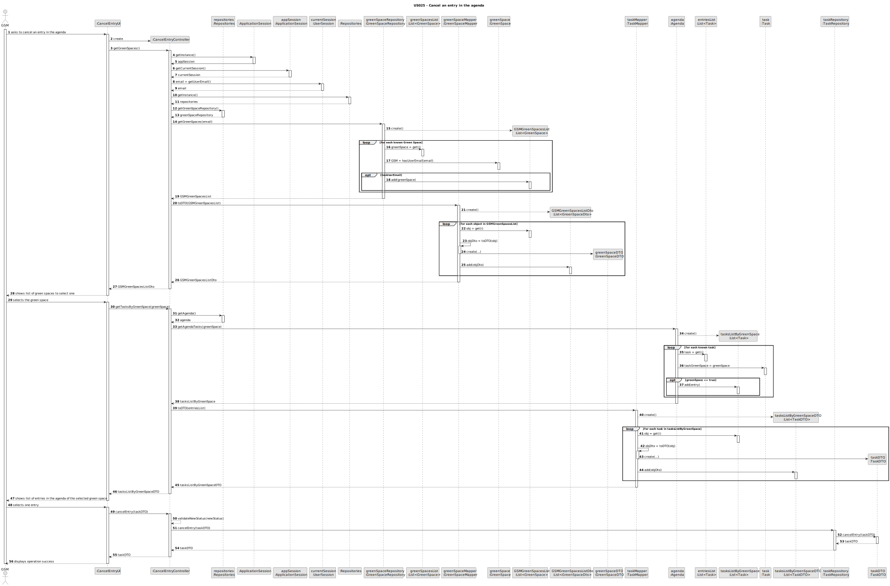
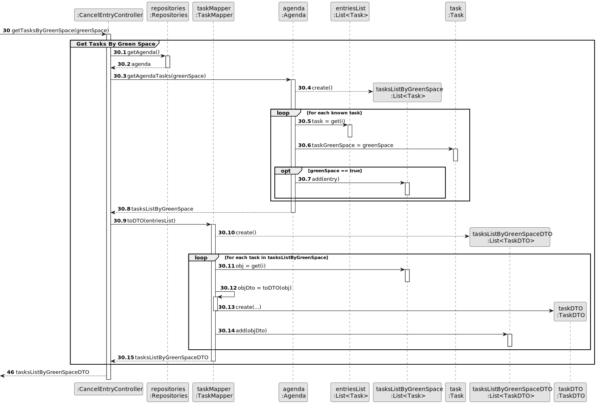

# US025 - Cancel an entry in the agenda

## 3. Design - User Story Realization 

### 3.1. Rationale

| Interaction ID | Question: Which class is responsible for...                      | Answer                | Justification (with patterns)            |
|:---------------|:-----------------------------------------------------------------|:----------------------|:-----------------------------------------|
| Step 1         | ...interacting with the actor?                                   | CancelEntryUI         | Pure Fabrication                         |
|                | ...coordinating the US?                                          | CancelEntryController | Pure Fabrication, Controller             |
|                | ...obtaining the green spaces list?                              | GreenSpaceRepository  | Pure Fabrication, Information Expert     |
| Step 2         | ...displaying green spaces list?                                 | CancelEntryUI         | Pure Fabrication                         |
| Step 3         | ...saving the selected entry?                                    | PostponeEntryUI       | Pure Fabrication                          |   
|                | ...obtaining tasks by green space?                               | Agenda                | Pure Fabrication, Information Expert     |
| Step 4         | ...displaying entries in the agenda of the selected green space? | CancelEntryUI         | Pure Fabrication                         |
| Step 5         | ...saving the change of status?                                  | TaskRepository        | Pure Fabrication,  Information Expert    |              
| Step 6         | ...informing operation success?                                  | CancelEntryUI         | Pure Fabrication                         |

### Systematization ##

According to the taken rationale, the conceptual classes promoted to software classes are: 

* Task
* GreenSpace

Other software classes (i.e. Pure Fabrication) identified: 

* CancelEntryUI  
* CancelEntryController
* TaskRepository
* GreenSpaceRepository
* Agenda

## 3.2. Sequence Diagram (SD)

### Full Diagram

### Split Diagrams

**Get Green Spaces**

**Get Tasks by Green Space**

## 3.3. Class Diagram (CD)

