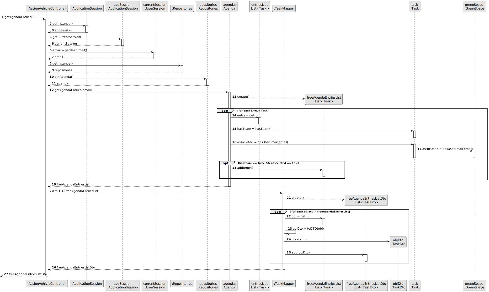

# US026 -  Assign  vehicles to the Agenda

## 3. Design - User Story Realization

### 3.1. Rationale

| Interaction ID | Question: Which class is responsible for...                  | Answer                  | Justification (with patterns)             |
|:---------------|:-------------------------------------------------------------|:------------------------|:------------------------------------------|
| Step 1  		     | 	... interacting with the actor?                             | AssignVehicleUI         | Pure Fabrication                          |
|                | ... coordinating the US?                                     | AssignVehicleController | Pure Fabrication, Controller              |
|                | ... knowing the uset using the system?                       | UserSession             | Information Expert                        |
|                | ... knowing to which user belongs the entry?                 | GreenSpace              | Information Expert                        |
| 			  		        | 	... obtaining the Agenda entries?                           | Agenda                  | Information Expert                        |
|                | ... converting the entries list into DTO?                    | TaskMapper              | Pure Fabrication, Information Expert, DTO |
| Step 2  		     | ... displaying the Agenda entries?						                     | AssignVehicleUI         | Pure Fabrication                          |
| Step 3  		     | 	... identifying the selected entry?                         | Agenda                  | Information Expert                        |
|                | ... obtaining the Vehicles?                                  | VehicleRepository       | Pure Fabrication, Information Expert      |
|                | ... converting the vehicles list into DTO?                   | VehicleMapper              | Pure Fabrication, Information Expert, DTO |
| Step 4  		     | 	... displaying the Vehicles?                                | AssignVehicleUI         | Pure Fabrication                          |
| Step 5  		     | 	... identifying the selected vehicle?                       | VehicleRepository          | Pure Fabrication, Information Expert      |
|                | ... checking if there are conflicts with vehicle's schedule? | Task                    | Information Expert                        |
|                | ... saving the edited entry?                                 | Agenda                  | Creator                                   |
| Step 7  		     | 				... validating the user's answer (yes/no)			             | AssignVehicleController |                  	Controller                                                                                           |              
| Step 8  		     | 				... showing the vehicles list (if yes)	                  | AssignVehicleUI         |Information Expert                                                                                            |              
| Step 9  		     | 					... saving the additional selected vehicle(s) (if yes)	 | Agenda                  |Information Expert                                                                 |              
| Step 10 		     | 	... informing operation success? 	                          | AssignTeamUI            | Pure Fabrication                          |

According to the taken rationale, the conceptual classes promoted to software classes are:

* Task
* Agenda
* GreenSpace

Other software classes (i.e. Pure Fabrication) identified:

* AssignVehicleUI
* AssignVehicleController
* TaskMapper
* VehicleRepository
* VehicleMapper

## 3.2. Sequence Diagram (SD)

### Full Diagram

### Split Diagrams

**Get Entries in the Agenda**

**Get Selected Task**

## 3.3. Class Diagram (CD)

