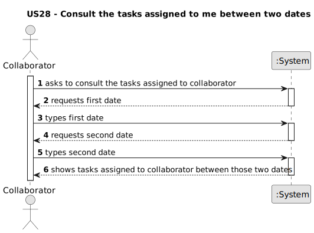

# US028 - Consult the tasks assigned to a collaborator

## 1. Requirements Engineering

### 1.1. User Story Description

- As a Collaborator, I wish to consult the tasks assigned to me.

### 1.2. Customer Specifications and Clarifications

**From the specifications document:**
// TODO

**From the client clarifications:**
// TODO

### 1.3. Acceptance Criteria

* **AC1:** All required fields must be filled in.
* **AC2:** The list of green spaces must be sorted by date.
* **AC3:** The Collaborator should be able to filter the results by the status of the task.

### 1.4. Found out Dependencies

* There is a dependency on "US22 - Add entry in the agenda" as there must be at least one entry in the agenda.
* There is a dependency on "US23 - Assign a team to an entry in the agenda" as there must be at least one entry assigned to the collaborator.

### 1.5 Input and Output Data

**Input Data:**

* Typed data:
  * Dates

**Output Data:**

* Tasks assigned to the collaborator between two dates
* (In)Success of the operation

### 1.6. System Sequence Diagram (SSD)

### 1.7 Other Relevant Remarks

n/a