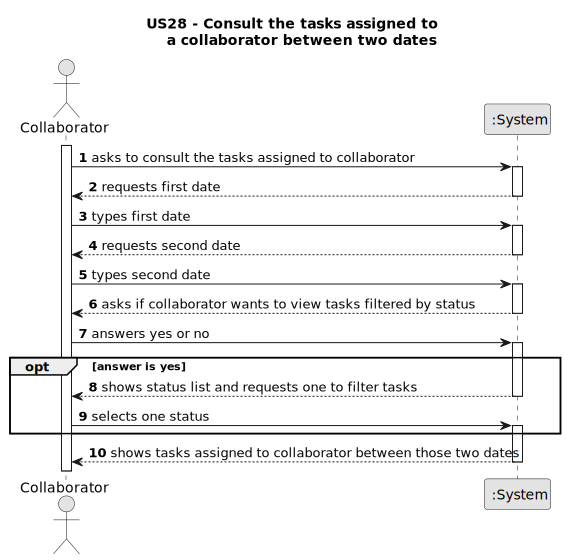

# US028 - Consult the tasks assigned to a collaborator between two dates

## 1. Requirements Engineering

### 1.1. User Story Description

- As a Collaborator, I wish to consult the tasks assigned to me between two dates.

### 1.2. Customer Specifications and Clarifications

**From the client clarifications:**
> **Question:** The collaborator can have more than one task assigned to them. To ensure that, the same task should be available for more than one team, am I right? 
> The reason for that question is so that if a task is strictly related to only one team, a collaborator will end up being in two teams simultaneously, which cannot happen.
> 
> **Answer:** A team can have multiple task assigned, hence, if a collaborator belongs to a team. 
> Besides, a collaborator can move from a team to another, so during, for instance, a month period a collaborator can belong to multiples teams.

> **Question:** A collaborator could have assigned at the same time different tasks from different teams, isn't it? 
> Apart, which atributes has a task ( maybe something like: name, frequency, creation_date, lenght, status)? Which id do you want (I think name is not a good idea)? Which status could a task have?
>
> **Answer:** No, in a specific period (for instance during a week) a collaborator just belongs to team. But if you consider a wider period you may find different teams to which a collaborator belonged.
> In this project no distinction will be made between recorrent/occasional tasks; I suppose that the identification is a combination of Name, Date and Local, like Prunning Trees at 20/05/2024 in Parque da Cidade.

### 1.3. Acceptance Criteria

* **AC1:** All required fields must be filled in.
* **AC2:** The list of tasks must be sorted by date.
* **AC3:** The Collaborator should be able to filter the results by the status of the task.

### 1.4. Found out Dependencies

* There is a dependency on "US22 - Add entry in the agenda" as there must be at least one entry in the agenda.
* There is a dependency on "US23 - Assign a team to an entry in the agenda" as there must be at least one entry assigned to the collaborator.

### 1.5 Input and Output Data

**Input Data:**

* Typed data:
  * Start Date
  * End Date

* Selected data:
  * a status

**Output Data:**

* List of status
* Tasks assigned to the collaborator between two dates
* (In)Success of the operation

### 1.6. System Sequence Diagram (SSD)

### 1.7 Other Relevant Remarks

n/a