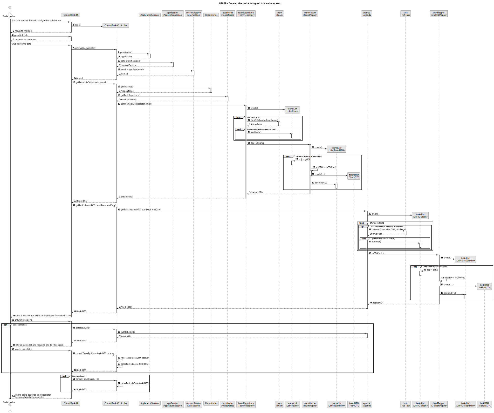
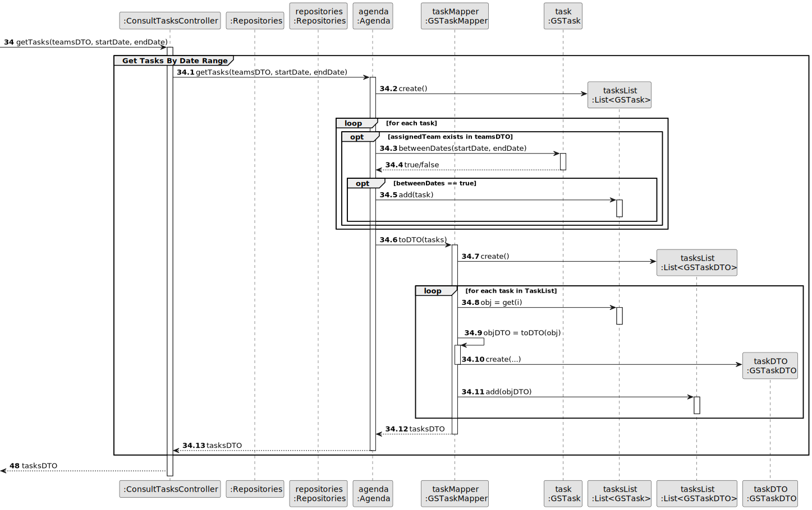

# US28 - As a Collaborator, I wish to consult the tasks assigned to me

## 3. Design - User Story Realization

### 3.1. Rationale

_**Note that SSD - Alternative One is adopted.**_

| Interaction ID | Question: Which class is responsible for...      | Answer                     | Justification (with patterns)                   |
|:---------------|:-------------------------------------------------|:---------------------------|:------------------------------------------------|
| Step 1         | ...interacting with the actor?                   | ConsultTasksUI             | Pure Fabrication                                |
|                | ...coordinating the US?                          | ConsultTasksController     | Pure Fabrication, Controller                    |
| Step 2         | ...requesting first date?                        | ConsultTasksUI             | Pure Fabrication                                |
| Step 3         | ...saving typed date?                            | ConsultTasksUI             | Pure Fabrication                                |
| Step 4         | ...requesting second date?                       | ConsultTasksUI             | Pure Fabrication                                |
| Step 5         | ...saving typed date?                            | ConsultTasksUI             | Pure Fabrication                                |
|                | ...obtaining list of teams?                      | TeamRepository             | Pure Fabrication, Information Expert            |
|                | ...obtaining list of collaborator's tasks?       | TaskRepository             | Pure Fabrication, Information Expert            |
| Step 6         | ...asking if collaborator wants to filter tasks? | ConsultTasksUI             | Pure Fabrication                                |              
| Step 7         | ...obtaining status list?                        | TaskRepository             | Pure Fabrication, Information Expert            | 
| Step 8         | ...displaying status list?                       | ConsultTasksUI             | Pure Fabrication, Information Expert            | 
| Step 9         | ...obtaining tasks ordered by date?              | ConsultTasksController     | Pure Fabrication, Controller                    |
| Step 10        | ...displaying tasks?                             | ConsultTasksUI             | Pure Fabrication                                |

### Systematization ##

According to the taken rationale, the conceptual classes promoted to software classes are:

* Task

Other software classes (i.e. Pure Fabrication) identified:

* ConsultTasksUI
* ConsultTasksController
* TaskRepository
* TeamRepository

## 3.2. Sequence Diagram (SD)

### Full Diagram

### Split Diagrams

**Get Email**

**Get Teams**

**Get Tasks**

## 3.3. Class Diagram (CD)

