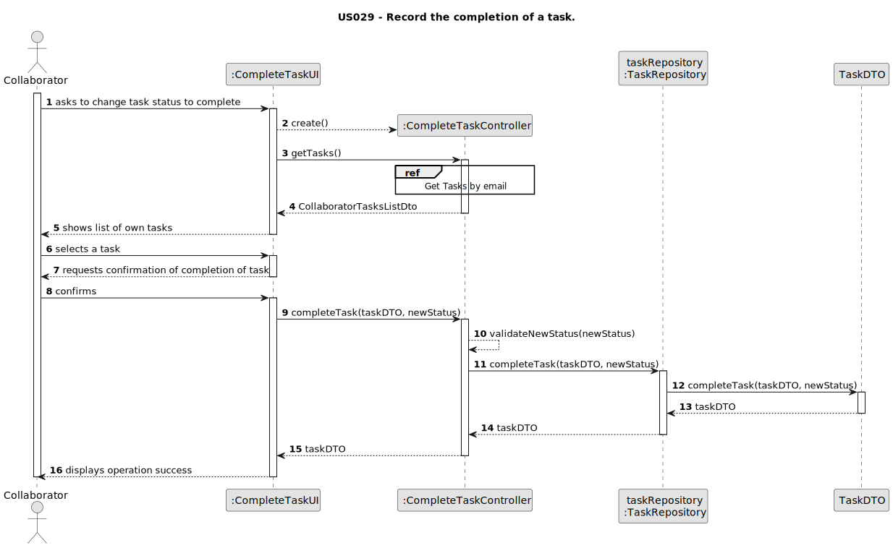
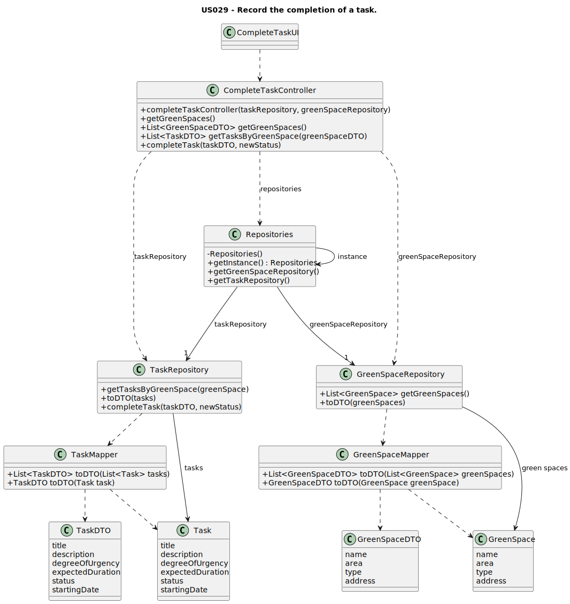

# US029 - Record the completion of a task.

## 3. Design - User Story Realization

### 3.1. Rationale

_**Note that SSD - Alternative One is adopted.**_

| Interaction ID | Question: Which class is responsible for...    | Answer                 | Justification (with patterns)                   |
|:---------------|:-----------------------------------------------|:-----------------------|:------------------------------------------------|
| Step 1         | ...interacting with the actor?                 | CompleteTaskUI         | Pure Fabrication                                |
|                | ...coordinating the US?                        | CompleteTaskController | Pure Fabrication, Controller                    |
|                | ...obtaining list of tasks?                    | TaskRepository         | Pure Fabrication, Information Expert            |
|                | ... knowing the user using the system?         | UserSession            | Information Expert                        |
|                | ...obtaining list of collaborator's tasks?     | TaskRepository         | Pure Fabrication, Information Expert            |
| Step 2         | ...asking to choose a skill?                   | CompleteTaskUI         | Pure Fabrication                                |
| Step 3         | ..choosing the skill from the list?            | CompleteTaskUI         | Pure Fabrication                                |
| Step 4         | ...asking for confirmation of task completion? | CompleteTaskUI         | Pure Fabrication                                |              
| Step 5         | ...validating new task status?                 | TaskRepository         | Pure Fabrication, Information Expert            | 
| Step 6         | ...showing operation success?                  | CompleteTaskUI         | Pure Fabrication, Information Expert            | 

### Systematization ##

According to the taken rationale, the conceptual classes promoted to software classes are:

* Task

Other software classes (i.e. Pure Fabrication) identified:

* CompleteTaskUI
* CompleteTaskController
* TaskRepository

## 3.2. Sequence Diagram (SD)

### Full Diagram

### Split Diagrams

**Get Tasks by email**

## 3.3. Class Diagram (CD)

